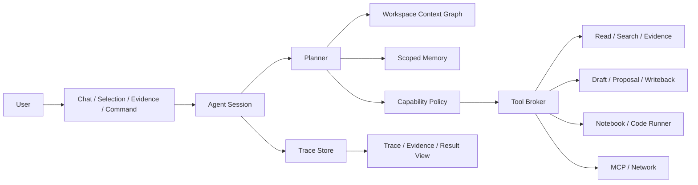

# AI Agent Workbench Plan

Last updated: 2026-06-09

This document defines the next AI Chat / Agent system direction for Lattice. It is intentionally grounded in the current codebase: Lattice already has `AiOrchestrator`, `AiContextGraph`, Evidence refs, Prompt Templates, Selection AI, and AI Workbench drafts/proposals. The next phase is to turn those pieces into a coherent research agent workbench, not to bolt on a generic autonomous coding agent.

Execution tracker: use `docs/AI_AGENT_SYSTEM_TODO.md` as the implementation master checklist. This plan explains the architecture and phase intent; the system todo owns concrete task packages, acceptance criteria, suggested code areas, and verification commands.

## Phase Numbering Contract

The main Research Agent roadmap uses Phase/P0-P5 as the sequential product track:

- P0/Phase 0: product entry and contract foundation.
- P1/Phase 1: Agent Session and Trace UI.
- P2/Phase 2: Tool Broker and controlled multi-step execution.
- P2.5: runner approval closure and interaction simplification.
- P3/Phase 3: Memory and long-context strategy.
- P4/Phase 4: workflow presets and productized research workflows.
- P5/Phase 5: proactive suggestions and production hardening.

`AI_AGENT_SYSTEM_TODO.md` also contains P6, a horizontal Lattice Product Skills Adaptation Backlog derived from the user-provided Lattice adaptation prompt. P6 is not a replacement for P4/P5 and does not mean the main track has skipped ahead. P6 items are pulled into the active main phase only when they support that phase or are explicitly scheduled. PDF-scoped P6 work remains owned by the separate PDF window.

Current active work is P5 closeout plus scheduled current-thread P6 slices that strengthen the Research Agent main path. The AI Agent thread owns workflow execution profiles, note-taking config, Tool Broker policy integration, Trace/approval contracts, and non-PDF workflow surfaces; PDF item workspace and PDF annotation writeback remain in the separate PDF implementation window.

## Design Thesis

Lattice should become an evidence-first research workbench with agentic execution under explicit user control.

The product target is closer to a hybrid of:

- Cursor: chat, agent modes, explicit context, rules, memories, and workspace-aware editing.
- Claude Code / Codex: codebase-scale reasoning, tool execution, permission gates, sessions, and traceable results.
- OpenAI Agents SDK: small primitives for agents, tools, handoffs, guardrails, sessions, and tracing.
- OpenClaw: local-first, always-available assistant ideas, but with stricter Lattice-specific safety defaults.

The core difference is domain focus. Lattice is not only a coding tool. It must reason over PDFs, annotations, markdown notes, notebooks, code, execution results, and workspace knowledge graphs.

Lattice-specific product rules should become typed skills/tools over existing services, not brittle prompt-only instructions. The implementation checklist for those skills lives in `docs/AI_AGENT_SYSTEM_TODO.md` under P6. PDF item and annotation writeback remain assigned to the separate PDF implementation window, while this AI Agent thread owns the shared workflow registry, note-taking config model, policy integration, trace/approval contract, and non-PDF workflow surfaces.

## Current Baseline

Already available:

- `src/lib/ai/orchestrator.ts`: unified entry point for chat, inline actions, research actions, and safe task proposals.
- `src/lib/ai/context-graph.ts`: focus context and evidence refs from selections, files, headings, annotations, code symbols, notebooks, and workspace chunks.
- `src/components/ai/ai-chat-panel.tsx`: docked chat surface with Evidence Panel, Prompt Templates, mentions, drafts, and proposals.
- `src/stores/ai-chat-store.ts`: persisted chat conversations and message metadata.
- `src/stores/ai-workbench-store.ts`: persisted drafts, proposals, linked proposal drafts, and approval state.
- `src/lib/ai/workbench-actions.ts`: draft formatting, proposal-to-draft generation, and approval-gated writeback.
- `src/lib/ai/workspace-indexer.ts`: lightweight workspace index and content chunking.
- `src/lib/prompt/executor.ts`: shared PromptTemplate execution path into chat, draft, or proposal outputs.

Resolved legacy cleanup:

- The standalone `src/lib/ai/agent.ts` prototype has been removed. The older `AiTool*` / `AgentTask` types that only served it were removed from `src/lib/ai/types.ts`; production agent execution now flows through policy, session, Tool Broker, and Trace panel primitives.

## External Architecture Lessons

The useful pattern is not raw feature copying. The pattern is the execution contract:

- Agents need named capabilities, tool schemas, input/output validation, and step limits.
- Tools need permission decisions before execution, especially for writes, code execution, shell execution, network, scheduled/background work, and memory writes.
- Long-context systems need explicit context budgets, evidence prioritization, summarization, and session compaction.
- Agent outputs need trace events that users can inspect: plan, context, tool call, tool result, draft, writeback, error, and final answer.
- Memory must be scoped: project instructions, workspace memory, conversation/session memory, and user preference memory are different surfaces.
- Background or proactive suggestions must be opt-in and should create suggestions/proposals, not silently mutate workspace state.

## Target Architecture

### Core Primitives

`AgentSession`

- Owns a user-visible run.
- Stores mode, task, context snapshot, memory snapshot, trace events, token budgets, result artifacts, and cancellation status.
- Can be resumed or compacted.

`AgentCapabilityPolicy`

- Decides whether a capability is `auto`, `ask`, or `deny`.
- Starts with conservative profiles: `chat`, `research`, `writeback`, `automation`.
- Implemented initially in `src/lib/ai/agent-policy.ts`.

`AgentToolBroker`

- The only execution path for agent tools.
- Validates arguments, checks policy, records trace events, and returns typed tool results.
- Reuses existing Lattice services instead of duplicating them.

`AgentTrace`

- Append-only event log for each run.
- Powers a future UI similar to "what did the agent inspect, decide, run, and write?"

`AgentMemory`

- Separate from chat history.
- Stores durable workspace facts, project preferences, pinned research goals, and reusable context summaries.
- Must expose source and timestamp for every memory entry.

`AgentContextPack`

- A budgeted, inspectable context bundle.
- Contains explicit evidence, selected text, active file summary, relevant workspace chunks, memory entries, and optional heavy inputs.

## Agent Modes

### Chat

Purpose: answer with explicit evidence and optional lightweight context.

Policy:

- Auto: resolve evidence, read memory.
- Deny: workspace writes, code execution, shell execution, network, scheduling.
- Max steps: 1.

### Research Agent

Purpose: inspect workspace context, compare sources, produce evidence-backed conclusions and drafts.

Policy:

- Auto: read/search workspace, resolve evidence, read memory.
- Ask: draft creation, code execution, memory write.
- Deny: direct writes, shell, network, scheduling.

### Writeback Agent

Purpose: turn approved plans into drafts or workspace edits.

Policy:

- Auto: read/search workspace, resolve evidence, create drafts, propose writes.
- Ask: direct writeback and code execution.
- Deny by default: shell, network, background scheduling.

### Automation Agent

Purpose: opt-in recurring or background research workflows.

Policy:

- Auto: read/search/resolve evidence.
- Ask: drafts, writes, scheduling, memory writes, code execution.
- Deny by default: network and host shell until a separate security model exists.

## Roadmap

### Phase 0: Contract and Planning

Status: started.

Deliverables:

- Add this architecture document.
- Add capability policy module and tests.
- Keep existing Chat / Evidence / Workbench behavior unchanged.

Acceptance:

- Agent capability decisions are testable.
- Future UI can present the same policy decisions before tool execution.

### Phase 1: Agent Session and Trace Store

Deliverables:

- `agent-session-store.ts` with persisted sessions and trace events.
- Event types: `planning`, `context_resolved`, `tool_requested`, `approval_required`, `tool_result`, `draft_created`, `proposal_created`, `writeback_applied`, `error`, `completed`.
- UI panel inside AI Chat to inspect the trace for a run.

Acceptance:

- A research run can be audited after refresh.
- Errors show stage, tool, and recovery action.

### Phase 2: Tool Broker Over Existing Lattice Services

Deliverables:

- Read/search/evidence tools backed by `workspace-indexer`, `mention-resolver`, and `context-graph`.
- Draft/proposal tools backed by `ai-workbench-store` and `workbench-actions`.
- Runner tools backed by existing workspace runner APIs, approval-gated.
- Remove the current standalone `agent.ts` prototype after the broker path is complete.

Acceptance:

- No agent tool directly reads/writes outside broker-managed APIs.
- Every non-read tool creates an approval or trace event.

### Phase 2.5: Runner Execution Approval Closure

Status:

- `runner.runCode` now defaults to the real workspace runner adapter in `src/lib/ai/agent-runner-tool.ts` when no test override is injected.
- `run_code` remains approval-gated by default for `research`, `writeback`, and `automation` profiles.
- Agent Trace approval buttons replay pending Tool Broker requests, so approval is an execution closure, not only a trace event.
- Runner failures are converted into Tool Broker failures and written back to the trace as `error` events.
- The standalone `src/lib/ai/agent.ts` prototype and its `AiTool*` / `AgentTask` types have been removed to prevent new production work from extending that path.

Verification:

- `src/lib/__tests__/ai-agent-tool-broker.test.ts` covers blocked-before-approval, approved execution, and failure trace writes.
- `src/components/ai/__tests__/agent-trace-panel.test.tsx` covers approval from the Trace panel through both injected and default runner paths.

### Phase 3: Long Context and Memory

Deliverables:

- Context pack builder with explicit budgets by source.
- Workspace summary cache and session compaction.
- Memory store with scopes: `workspace`, `project`, `conversation`, `user`.
- Memory UI: inspect, pin, disable, delete, and cite memory entries.

Acceptance:

- Long research tasks keep useful state without dumping full files by default.
- Every memory entry has provenance and can be removed.

Status:

- `src/lib/ai/research-agent.ts` now provides the formal Research Agent orchestration entry point for deterministic research runs.
- `src/lib/ai/research-agent-planner.ts` owns the Research Agent plan schema, default plan generation, supported tool-name validation, required core-step validation, and fallback-to-default behavior for invalid custom plans.
- `src/lib/ai/research-agent-llm-planner.ts` provides the pure LLM planner adapter: JSON-only prompt construction, fenced/plain JSON extraction, schema normalization, and safe fallback warnings for malformed or unsafe model output.
- `src/lib/ai/research-agent-planner-provider.ts` adapts existing Lattice AI runtime settings and `routeModel` selections into a planner-ready `generatePlan(messages, options)` function.
- `src/lib/ai/research-agent-chat-runner.ts` adapts the formal Research Agent path into product surfaces: planner routing, deterministic fallback when provider routing is unavailable, chat answer formatting, and planner model metadata. `runResearchAgentForChat` remains a compatibility wrapper over the shared `runResearchAgentForSurface`.
- `src/components/ai/ai-chat-panel.tsx` now exposes a product-facing Research Agent action in AI Chat. It collects current file content, selection, annotations, workspace identity, explicit evidence refs, runtime settings, and writes the Research Agent answer back into chat with `promptContext` and evidence refs.
- `src/components/diagnostics/ai-chat-research-agent-diagnostics.tsx` provides browser-level coverage for the product-facing AI Chat Research Agent path with local planner provider override, active-file context, chat metadata, and trace readout.
- `src/lib/ai/selection-actions.ts` now routes Selection AI `agent` mode through the same formal Research Agent surface runner, preserving selection origin metadata and writing the evidence-backed answer into AI Chat.
- `src/components/ai/agent-trace-panel.tsx` now renders a Research Agent audit view from existing trace metadata: plan source, fallback warnings, planner prompt/raw output previews, plan step rows, step status, tool bindings, event details, and compaction summaries.
- `src/lib/ai/research-agent.ts` records truncated `plannerPromptPreview` and `plannerRawOutputPreview` values in the `plan-created` trace metadata, keeping the trace auditable without storing full long planner payloads in the UI.
- `src/lib/ai/agent-session.ts` now retains planner audit anchor events through session compaction, so compressed sessions still expose planner source, warning count, prompt preview, and raw output preview.
- `src/lib/ai/research-agent-tool-loop.ts` adds the first controlled multi-step execution slice: planner-selected `workspace.search` and `workspace.readIndexedContext` steps execute through `AgentToolBroker`, update plan-step trace status, and return summarized `toolResults`.
- `src/lib/ai/research-agent-tool-loop.ts` now enforces a bounded read-tool step limit and checks cancellation around controlled read/search execution so planner loops cannot run away.
- `src/lib/ai/agent-tool-broker.ts` now exposes a stable tool result preview contract: completed tool executions return `resultPreview` plus primitive `resultMetadata`, and `tool_result` trace events persist the same preview metadata for read/search/evidence/artifact/code tools.
- `src/lib/ai/research-agent-tool-loop.ts` now emits stable tool observations with step id, tool name, status, preview, evidence count, and primitive metadata preview. `ResearchAgentRunResult`, synthesis trace metadata, chat `agentResult`, and structured AI result sections carry these observations as the bridge toward a fuller observe-plan-act loop.
- `src/lib/ai/research-agent.ts` now performs a bounded observation-aware observe-plan-act loop after completed read-tool observations when an injected planner is available. Default behavior remains one replan, while `maxObservationReplans > 1` enables additional bounded iterations. Replan prompts include only current tool observations, only pending existing steps can be updated, planner-invented steps are ignored for safety, and final updated `evidence.resolve` args affect the next Tool Broker call.
- Observation replan trace metadata now includes iteration, budget, stop reason, and observation quality counters. Multi-iteration loops stop on duplicate observations or all-low-value observations, so repeated empty searches do not keep burning planner turns.
- Observation replan trace metadata now also includes a compact recovery recommendation derived from stop reason and observation quality. Trace renders the recommendation inside the existing observation card, making blocked, failed, duplicate, low-value, budget-exhausted, or planner-unavailable stops actionable without adding a new control.
- `src/components/ai/agent-trace-panel.tsx` now renders observation-replan audit cards in the timeline, showing reviewed observation count, quality summary, updated pending step ids, ignored planner-invented step ids, and observation previews without forcing users into raw metadata JSON.
- `src/lib/ai/research-agent.ts` now reuses an existing non-terminal `sessionId` instead of replacing its trace, and `src/lib/ai/research-agent-tool-loop.ts` restores completed read-tool observations from that trace, skips duplicate read-tool execution for completed planner steps, and writes an explicit skip trace so resumed runs can continue from prior observations without rerunning completed workspace searches.
- Research Agent evidence resolution now writes bounded `resolvedPromptPreview` / context counts / evidence counts into the completed `evidence-resolve` plan-step trace. Resume runs can restore a clearly marked prompt context from that trace, preserve evidence refs, skip duplicate `evidence.resolve` Tool Broker calls, and continue synthesis from the restored evidence context.
- Research Agent synthesis now writes bounded `answerPreview` into both the completed `synthesize-answer` plan-step trace and synthesis trace. Resume runs can restore a clearly marked synthesis preview, skip duplicate answer synthesis, and continue approval/compaction work from the restored answer preview.
- Approval reconciliation now reads restored synthesis previews from the same session trace, records approval id/tool/result preview plus restored synthesis preview on completed approval plan-step traces, and marks completion messages when approvals finish against restored synthesis context.
- `src/components/ai/agent-trace-panel.tsx` now renders compact restored-context audit cards for restored evidence prompt previews, restored answer previews, and approval resume synthesis previews, so resume state is visible without opening raw metadata.
- `src/lib/ai/agent-tool-broker.ts` now exposes a lightweight `AGENT_TOOL_DESCRIPTORS` registry. Each tool has a stable name, capability, label, description, argument summary, and result summary that can be reused by policy, Trace, and planner surfaces without introducing a heavyweight schema framework.
- Tool Broker `tool_requested` and `approval_required` trace events now include descriptor metadata such as tool label, description, argument summary, and result summary.
- Pending approval records now persist the same Tool Broker descriptor snapshot, so approval cards can show the tool label, description, argument contract, and expected result contract without re-resolving current registry state.
- `src/lib/ai/agent-tool-broker.ts` now supports `memory.write` as an approval-gated memory-write tool. Memory candidates are persisted only after approval and produce `memory_updated` trace events.
- Approved `memory.write` results now merge the saved memory id back into `AgentSession.memorySnapshotIds`, and `memory_updated` trace metadata records a bounded `memorySnapshotIdsPreview`. Newly approved memories are therefore visible to the current run, later compaction, and continuation recovery.
- `src/lib/ai/agent-memory.ts` now supports source fingerprints for memory candidates. Suggestions are deduped by the existing scope/title key and by stable source fingerprint, so repeated Research Agent runs over the same evidence-backed finding do not keep producing duplicate long-term memory candidates.
- `src/lib/ai/research-agent.ts` now stamps generated memory candidates with a deterministic source fingerprint derived from workspace/session, workflow, query, evidence locator, and prompt-context preview.
- Research Agent memory candidates are now answer-first rather than raw-context-first: candidate content uses the final synthesis answer as the reusable finding, then records evidence context, context pack id/token/truncation status, omitted-context summary, and recovery hints for long-term auditability.
- `src/lib/ai/agent-tool-broker.ts` now carries `memorySourceFingerprint` through memory-write result metadata and `memory_updated` trace events.
- `src/stores/agent-session-store.ts` now exposes a narrow `addMemorySnapshotIds` action backed by a pure session helper, keeping approval-time memory provenance in the AgentSession without adding another UI control.
- `src/lib/ai/agent-context-pack.ts` now emits `omittedSummary` for truncated context packs: omitted count, estimated tokens, source grouping, and compact label previews. Prompts receive only the summary, not omitted full text.
- `src/lib/ai/agent-context-pack.ts` now also emits deterministic omitted-content semantic previews. Each omitted source keeps short `contentPreviews`, and the overall `semanticPreview` is length-bounded so long-context recovery has useful content clues without re-including full omitted text or calling an LLM.
- `src/lib/ai/agent-context-pack.ts` now also emits deterministic extractive omitted `autoSummary` entries and a bounded `autoSummaryPreview`. Each source-level summary includes omitted count/tokens, labels, lightweight keywords, and representative previews, giving planner, trace, continuation, and memory review surfaces a stable summary layer that remains the fallback for model-generated summaries.
- `src/lib/ai/agent-context-pack.ts` now adds bounded omitted-context `recoveryHints` and a `recoveryHintsPreview`, ranking omitted items by priority/token weight so compressed context retains actionable source, label, locator, token estimate, and content-preview clues.
- `src/lib/ai/agent-context-pack.ts` now adds `recoveryPriorityPreview` and priority-scored omitted recovery hints. Scores combine item priority, source weight, token weight, and locator presence so continuation runs can see which omitted content is worth recovering first.
- `src/lib/ai/agent-context-pack.ts` now emits structured omitted `recoveryPlan` items with recovery action, omission reason, locator, token estimate, priority score/reason, and content preview. Prompts and trace metadata receive a bounded `recoveryPlanPreview`, giving compressed context an inspectable recovery strategy rather than only unstructured hints.
- `src/lib/ai/research-agent.ts` now turns high-priority omitted-context locators from continuation recovery into bounded `workspace.readIndexedContext` plan steps. The reads are inserted after context-pack construction, executed through the existing Tool Broker read loop, and audited with recovery read path metadata.
- `src/lib/ai/research-agent.ts` now restores omitted recovery plan previews from source session trace/compaction metadata. Continuation planner context and heavy input include the plan preview, and recovery read planning prefers plan locators before falling back to legacy priority previews.
- `src/lib/ai/research-agent.ts` now writes omitted auto summaries into trace metadata, preserves them through session compaction, restores them into continuation planner/heavy input context, and includes them in memory suggestion provenance before approval.
- `src/lib/ai/research-agent.ts` now supports optional model-generated omitted-context summaries through a bounded `generateOmittedSummary` run hook. Generated summaries are prepended to planner context, reused by observation replans, written to trace with status/warning metadata, preserved by compaction, restored into continuation recovery context, and included in memory suggestion provenance; generator failures fall back to deterministic omitted auto summaries without blocking the run.
- `src/lib/ai/research-agent-planner-provider.ts` now implements the product generator for omitted-context model summaries by reusing the routed AI provider selected for Research Agent planning. The generator prompt is constrained to bounded omitted previews, auto summaries, semantic previews, and recovery plans; `src/lib/ai/research-agent-chat-runner.ts` passes it into `runResearchAgent` for Chat and Selection surfaces without adding another visible control.
- `src/lib/ai/research-agent.ts` now evaluates omitted model-summary quality deterministically. The audit scores length, keyword overlap with deterministic summaries, omission awareness, and recovery/source cues, then writes `omittedContextModelSummaryQuality*` trace metadata without blocking the run or making a second model call.
- `src/lib/ai/research-agent-tool-loop.ts` and `src/lib/ai/research-agent.ts` now mark those recovery reads as `recovery_read` observations with source locators. Observation replan prompts and trace metadata surface recovery observation counts plus locators, so later planner iterations can adapt to recovered omitted context instead of treating it as an anonymous read.
- `src/lib/ai/research-agent.ts` now evaluates continuation recovery quality as not_needed, complete, partial, weak, or missing from planned locators, observed recovery reads, coverage, and low-value results. Trace metadata and compact timeline cards surface the quality summary without blocking runs or adding hidden recovery actions.
- `src/lib/ai/research-agent.ts` now carries recovery observations into final synthesis metadata and memory suggestion provenance. Memory candidates record recovered omitted-context reads before approval, and Trace renders that provenance in compact memory suggestion audit cards.
- `src/lib/ai/research-agent.ts` now builds a bounded recovered-context digest from recovery observations. The digest records read count, completed/useful/low-value counts, locator preview, and compact observation summaries; final synthesis includes it as a separate section, synthesis trace records it, and memory suggestions include it in approval provenance without storing raw recovered context automatically.
- `memory.write` approval requests now carry review metadata: applicability, evidence summary, recovered-context summary, and a caution statement. `src/components/ai/agent-memory-panel.tsx` displays these cues in pending memory suggestions, while `src/components/ai/agent-trace-panel.tsx` mirrors them in memory suggestion audit cards.
- `src/lib/ai/agent-memory.ts` now classifies memory candidates into finding, preference, project rule, transient state, and unknown. Evaluation rejects transient session state and unclear candidates before approval, with explicit reason codes for Trace.
- `src/lib/ai/agent-memory.ts` now also runs a deterministic memory policy review before approval. It checks provenance, evidence cues, reusable-value cues, broad answer dumps, transient state, and unclear kinds; the policy can reject session-only state, lower confidence, or expose review reasons while keeping `memory.write` approval mandatory.
- `AgentMemoryEntry` now persists candidate kind for approved memories. The memory ranker boosts kind matches for research findings, preferences, and project rules, and the Memory panel displays saved memory kind in compact badges/details.
- Trace Memory read audit now includes kind-aware ranking reasons in the ranked preview, so users can see `kind:finding`, `kind:preference`, or `kind:project-rule` signals when memory enters the context pack.
- `src/lib/ai/agent-memory.ts` now evaluates saved memory lifecycle without mutating stored entries. The evaluator marks memories healthy, stale, weak, review, disabled, or deleted, recommends keep/review/refresh/disable/restore actions, and feeds conservative lifecycle score adjustments into context ranking.
- `src/components/ai/agent-memory-panel.tsx` now renders compact lifecycle badges and selected-memory detail rows so users can inspect memory health and recommended action without adding automatic cleanup or another management dialog.
- `tsconfig.json` now keeps generated `web-dist*` output types out of the source typecheck include set, so stale build artifacts cannot break the main quality gate.
- `src/components/editor/codemirror/live-preview/__tests__/live-preview-diagnostics.test.ts` now uses narrower decoration-data type guards, restoring the full TypeScript gate while keeping annotation/wiki/embed parsing assertions type-safe.
- `src/lib/ai/agent-context-budget-profiles.ts` now defines bounded internal Context Pack budget profiles for `chat`, `research`, `notebook`, `code`, and `knowledge-organization`. Research Agent runs resolve budgets through this profile layer instead of hard-coded runner literals, while preserving the current stable research budget by default.
- `src/lib/ai/research-agent-workflows.ts` now maps workflow context profiles to budget profile ids: notebook workflows use `notebook`, literature/knowledge organization workflows use `knowledge-organization`, teaching explanations use `chat`, and baseline markdown/reading workflows stay on `research`.
- `src/lib/ai/research-agent-workflows.ts` now includes tool schema summaries in workflow planner hints by reusing Tool Broker descriptors, so planner prompts describe allowed tool inputs and expected result shape consistently.
- `src/components/ai/agent-trace-panel.tsx` now renders Tool Broker descriptor metadata as structured Tool contract / Result contract details inside expanded trace rows. The default timeline stays compact, while expanded audit details show the tool label, description, argument summary, and result summary without duplicating those descriptor fields in raw metadata.
- `src/lib/ai/agent-tool-broker.ts` now emits a stable result schema envelope for completed tool results, including schema version, status, summary, metrics, artifact preview, and diagnostics preview where applicable. `src/components/ai/agent-trace-panel.tsx` renders these fields as a compact Result schema card without replacing the existing concise result preview.
- `src/lib/ai/research-agent-tool-loop.ts` now carries the same result schema fields into `ResearchAgentToolObservation`. Observation replan prompts and trace previews include bounded schema status, summary, metrics, artifacts, and diagnostics, making observe-plan-act loops react to structured tool outcomes instead of only raw result previews.
- `src/components/ai/agent-trace-panel.tsx` now also renders the same descriptor snapshot in pending approval cards, with compact argument preview and post-execution result/error preview when available.
- `src/components/ai/agent-trace-panel.tsx` now keeps recent processed approval records visible in a compact Approval results section. Completed, failed, rejected, approved, and executing requests reuse the same contract card in read-only mode, so result previews remain auditable after pending approval actions disappear.
- `src/components/ai/agent-trace-panel.tsx` now derives a compact Run Summary from the existing session and trace data. The summary surfaces workflow, completed/total plan steps, tool involvement, evidence count, approval progress, omitted context count/tokens, and memory suggestions without adding a new persisted metrics schema.
- `src/lib/ai/research-agent-chat-runner.ts` now lifts the latest observation recovery recommendation into `agentResult.recoverySummary` and chat text. `src/lib/ai/result-view-model.ts` renders that summary in the structured Run section, so users can see why an Agent stopped and how to continue without opening Trace first.
- `src/lib/ai/research-agent-chat-runner.ts` now also carries tool observation result schema fields into `agentResult.toolObservations`. The structured Observations section shows a compact count/status/tool summary, keeps the first representative observations with status, summary, metrics, artifacts, and diagnostics inline, and sends overflow details to Trace so the main Chat result exposes observation quality without becoming a log wall.
- `src/lib/ai/research-agent-chat-runner.ts` now also carries omitted-context summary metadata into `agentResult.contextSummary`. The structured Run section shows omitted item/token counts, model-summary status/quality, compact omitted preview, and recovery-plan preview, giving Chat users a clear long-context compression signal while keeping full recovery audit details in Trace.
- `src/lib/ai/research-agent-chat-runner.ts` now also carries pending memory suggestion metadata into `agentResult.memorySummary`. Chat Run sections show pending memory suggestion counts/titles, and AI Chat message actions expose a compact review-memory shortcut that activates the owning Agent Session so the existing Memory Panel can handle approval.
- This keeps the memory workflow aligned with the product rule: Research Agent may propose reusable findings automatically, but no memory is written silently; Chat only surfaces the pending count/title preview and routes review back to the existing approval panels.
- `src/lib/ai/research-agent.ts` now carries long-context and memory-quality signals into final synthesis, not only Trace. Deterministic answers include bounded omitted-context summaries/recovery plans and compact memory lifecycle health lines, while recovered omitted reads remain summarized through the recovered-context digest.
- `src/stores/agent-session-store.ts` now includes a transient panel focus target so Chat result actions can activate the owning Agent Session and open the correct Trace or Memory panel in one step. The focus target is consumed by the panel and is not persisted.
- P4 productization has started with automatic workflow inference for product Research Agent runs. When workflow is left on Auto, `runResearchAgentForSurface` infers a concrete preset from task, query, active file, selection, and content cues, then marks the result as inferred so Chat can show the chosen workflow without another primary control.
- `src/components/ai/ai-chat-panel.tsx` now renders structured Agent results with a lighter academic-tool layout: the Answer stays as normal response text, while Run / Plan / Observations use compact dividers and summary text instead of stacked cards. Long observation lists stay summarized in Chat and remain fully auditable through Trace.
- `src/components/ai/ai-chat-panel.tsx` now simplifies the main AI input bar around professional Chat / Agent interaction: the primary row shows mode, current model summary, Agent effort presets, and the prompt-template entry. Agent workflow and memory toggles remain available in a compact Advanced area, keeping automatic behavior as the default rather than exposing low-value controls first.
- The same input bar now supports a compact model quick switch: clicking the model summary opens a small provider/model editor backed by the existing Settings store. This gives fast Chat/Agent model changes without duplicating the full Settings AI configuration surface.
- `src/components/prompt/prompt-picker.tsx` now behaves more like a command-style template picker: selecting recent or all templates remains one click, edit/duplicate stays on a separate icon action, and the dock is visually narrower and denser so templates feel like quick actions rather than a review wizard.
- `src/components/prompt/prompt-editor-dialog.tsx` now uses a simpler template editing flow: title, description, main prompt body, and pinning stay visible by default, while category, surfaces, output mode, system prompt, context slots, and preferred provider/model are tucked into an Advanced section.
- `src/lib/ai/research-agent-chat-runner.ts` now passes workflow budget profile ids into `runResearchAgent`, so product surfaces get task-appropriate context budgeting without adding more visible controls to the AI Chat UI.
- `src/lib/ai/research-agent-chat-runner.ts` now resolves per-run memory read filters for product surfaces. Explicit advanced `memoryQuery` still wins, while default Chat/Selection runs automatically scope memory reads by workflow memory scopes, current workspace key, and conversation/session id without adding primary UI controls.
- `src/lib/ai/research-agent.ts` now records the effective memory read filter in trace metadata. Context-pack and memory-snapshot events include memory scopes, workspace/project/conversation filters, query limit, memory count, and a bounded memory id preview so memory use is auditable after a run.
- `src/components/ai/agent-trace-panel.tsx` now renders compact Memory read audit cards for context-pack and memory-snapshot events, showing loaded memory count, memory id previews, scopes, workspace/project/conversation filters, and query limit without requiring raw metadata expansion.
- `src/lib/ai/agent-memory.ts` now provides deterministic Research Agent memory ranking with scores and bounded reasons. Ranking considers pinned entries, workspace/project/conversation fit, title/content/source overlap with the task/query/selection/workflow/evidence, and recency as a final tie-breaker.
- `src/lib/ai/research-agent.ts` now ranks memory candidates before applying the per-run limit, preventing newer but irrelevant memory from crowding out task-relevant context. Context-pack and memory-snapshot trace metadata include candidate count, ranking query preview, and ranked memory preview.
- `src/components/ai/agent-trace-panel.tsx` now shows ranked memory previews and ranking query previews inside Memory read audit cards without adding another primary control.
- `src/components/ai/agent-memory-panel.tsx` now surfaces pending `memory.write` suggestions directly in the Memory panel with approve/reject controls, reusing the same Tool Broker approval records shown in Trace.
- `src/components/ai/agent-memory-panel.tsx` now shows memory candidate provenance before approval: suggestion reason, source label/locator, and a shortened source fingerprint. This keeps approval decisions inspectable without adding another dialog or settings surface.
- `src/components/ai/agent-memory-panel.tsx` and `src/components/ai/agent-trace-panel.tsx` now show memory policy summaries and reasons in pending suggestion review cards and Trace audit cards, keeping approval decisions inspectable without adding another dialog.
- `src/components/ai/agent-trace-panel.tsx` now renders compact Memory suggestion audit cards for accepted and skipped candidates, including reason, reason code, confidence, scope, title, duplicate memory id, and source fingerprint without requiring raw metadata expansion.
- `src/components/ai/agent-trace-panel.tsx` now also renders answer preview plus context-pack / omitted-context provenance for Memory suggestions, keeping approval decisions inspectable without adding another UI step.
- AI Chat Agent mode now includes a restrained per-run `Suggest memory` checkbox. It defaults on for product Research Agent runs and lets the user disable memory suggestions without changing workspace-wide settings.
- `src/components/ai/agent-trace-panel.tsx` now surfaces omitted-context metadata as a compact timeline card with omitted count, estimated tokens, and source preview.
- `src/components/ai/agent-trace-panel.tsx` now surfaces omitted auto summaries in omitted-context, continuation recovery, and memory suggestion audit cards while keeping the default timeline compact.
- `src/components/ai/agent-trace-panel.tsx` now surfaces optional model omitted summaries and generator status/warnings in omitted-context, continuation recovery, and memory suggestion audit cards while keeping the default timeline compact.
- `src/components/ai/agent-trace-panel.tsx` now also surfaces omitted model-summary quality status/score/reasons in the compact omitted-context audit card.
- `src/components/ai/agent-trace-panel.tsx` now also shows omitted semantic preview and recovery-hint preview when present, capped visually to keep the audit card compact.
- `src/components/ai/agent-trace-panel.tsx` now also shows omitted and continuation recovery priority previews, keeping long-context recovery explainable without adding another primary control.
- `src/components/ai/agent-trace-panel.tsx` now also shows omitted and continuation recovery plan previews in compact audit cards, exposing recovery actions and omission reasons without adding more user controls.
- `src/components/ai/agent-trace-panel.tsx` now also shows continuation recovery read paths, so users can see when compressed context was actively reread.
- `src/components/ai/agent-trace-panel.tsx` now also shows recovered-context digest summaries in synthesis/replan and memory suggestion cards, keeping recovered omitted context inspectable without adding another panel.
- `src/lib/ai/agent-session.ts` now records retained event count, source event kinds, and retained event id previews in compaction trace metadata. `src/components/ai/agent-trace-panel.tsx` surfaces retained event count and compacted source kinds in the Compactions card so compressed sessions remain easier to audit and recover from.
- `src/components/ai/agent-trace-panel.tsx` now adds compact Continue in Chat and Copy continuation prompt actions to compaction cards. The generated prompt includes session title/task/id, compaction summary, compacted/retained counts, source kinds, and preserved evidence so users can continue research from a compressed run without a new wizard UI.
- `src/stores/ai-chat-store.ts` now carries a transient `composerDraft` so Trace can fill the AI Chat composer without brittle DOM events or global component coupling. `ChatInput` consumes the draft, switches to Agent mode, and focuses the composer.
- Continuation is now a structured run contract, not only prompt text: `composerDraft.continuation` carries source session id, compaction id, and source summary into `runResearchAgentForChat`; `runResearchAgent` records those fields in `plan-created` trace metadata; chat result metadata and the structured Run section surface the continuation source for audit.
- `src/components/ai/agent-trace-panel.tsx` now derives a lightweight lineage card from continuation trace metadata. It shows Continued from and Continued by links, and lets users switch between related runs without adding a new persisted lineage schema.
- `src/lib/ai/research-agent-llm-planner.ts` now accepts a bounded `continuationSummary` and includes it in the planner prompt as Continuation context. `runResearchAgent` builds this summary from source session id, compaction id, and source summary so continuation runs plan next steps instead of blindly repeating prior work.
- `src/lib/ai/research-agent.ts` now restores continuation recovery context from the source `AgentSession`: preserved compaction/session evidence is merged into the next context pack, prior omitted recovery hints/semantic previews are injected as bounded heavy input, and trace metadata records recovered evidence counts for audit.
- Continuation planner prompts now receive recovery-aware continuation context, including recovered summaries, omitted recovery hints, omitted semantic previews, and recovered evidence refs, so resumed Research Agent runs can plan forward from compressed context instead of only seeing source ids.
- `src/components/ai/agent-trace-panel.tsx` now renders compact Continuation recovery audit cards with recovered evidence count, recovered summary, prior omitted recovery hints, and semantic previews in the timeline.
- `src/lib/ai/research-agent-tool-loop.ts` now reuses Tool Broker previews for planned tool summaries instead of maintaining separate result stringification logic.
- `src/components/ai/agent-trace-panel.tsx` now surfaces `resultPreview` directly in timeline rows while keeping full metadata available in the expandable details view.
- `src/lib/ai/research-agent-planner.ts` now accepts sanitized `toolArgs` for read/search/evidence tools and rejects planner-supplied args for gated write/code tools.
- `src/lib/ai/research-agent.ts` now propagates cancellation through the Research Agent lifecycle: before planner work, after planner generation, after session creation, during read-tool execution, before/after evidence resolution, and around artifact creation.
- `src/lib/ai/research-agent.ts` now exposes `finalizeResearchAgentApprovedArtifacts`, a resume-safe finalization path for paused Research Agent runs after approved draft/proposal tools complete. It reconciles approval state, artifact plan-step completion, session completion, and optional compaction without rerunning planner or evidence resolution.
- `src/lib/ai/research-agent.ts` now exposes `reconcileResearchAgentPendingApprovals`, a generalized pending-approval reconciliation path for artifact and non-artifact tools. The artifact finalizer remains a compatibility wrapper, while future gated tools such as `runner.runCode` can reconcile plan-step status, session completion, and optional compaction without rerunning planner/evidence.
- `src/lib/ai/research-agent.ts` now generates conservative memory candidates for product surface runs and routes them through `memory.write` approval. Lower-level `runResearchAgent` stays opt-in via `suggestMemory` to avoid implicit side effects in internal calls.
- `src/lib/ai/research-agent.ts` now returns an `approvalSummary` with waiting/executing/completed/failed approval counts and tool names, derived from `AgentSession.pendingApprovals` so Tool Broker execution remains the source of truth.
- `src/components/ai/agent-trace-panel.tsx` now wires approval execution to Research Agent reconciliation: after an approval succeeds, sessions with Research Agent planning trace metadata automatically reconcile pending approvals, while standalone Tool Broker sessions continue to return to `running`.
- `src/lib/ai/research-agent-chat-runner.ts` now surfaces approval/reconciliation status in formatted AI Chat answers only when an approval request exists.
- P2 stage audit hardening: Research Agent plan anchors now include explicit `agentKind: research_agent` metadata for safer Trace Panel reconciliation detection, while older plan-source/step-count metadata remains supported.
- P2 stage audit hardening: approval summaries now prioritize concrete approval-record status over stale session-level `waiting_approval`, preventing incorrect waiting-for-zero approval summaries after fast approval execution.
- `src/lib/ai/research-agent-llm-planner.ts` now rethrows provider `AbortError` so user/provider cancellation is not converted into a fallback plan.
- `src/lib/ai/research-agent-workflows.ts` now defines the first Lattice Product Skills foundation for the current AI Agent thread: workflow preset registry, context profiles, allowed tool lists, artifact policy, approval policy, trace labels, and configurable note-taking defaults.
- PDF-scoped workflows are registered but hidden by default so the current AI Agent surface can progress without implementing PDF writeback in this window.
- `src/lib/ai/research-agent-chat-runner.ts` now accepts workflow ids and note-taking overrides from product surfaces, resolves workflow presets, injects workflow hints into the LLM planner prompt, and returns workflow metadata for chat/result rendering.
- `src/lib/ai/research-agent.ts` now carries workflow id/title through the core run result and `plan-created` trace metadata, keeping workflow-mode runs auditable after compaction.
- `src/components/ai/ai-chat-panel.tsx` now exposes a restrained Chat / Agent mode switch. The default Research Agent path infers workflow automatically, while explicit non-PDF workflow presets remain available through Command Palette and advanced seeded runs.
- Research Agent assistant messages now persist lightweight `agentResult` metadata and render through the existing AI result-view model as structured Answer / Run / Plan sections. This keeps the raw chat text compatible while giving Agent runs a scan-friendly result view in AI Chat.
- Structured Research Agent result cards now include a compact Open trace action that activates the corresponding `AgentSession` from `agentResult.sessionId`, giving the in-chat answer a direct audit handoff without adding another primary UI surface.
- `src/lib/ai/selection-actions.ts` now maps Selection AI agent runs to workflow presets: notebook/code selections use `notebook-analysis`, while other default text contexts use `markdown-research`.
- `src/components/ui/plugin-command-dialog.tsx` now exposes Command Palette entries for non-PDF Research Agent workflows. Running a workflow command opens AI Chat and selects the workflow without bypassing Chat context collection, Tool Broker approval, or Trace.
- `runResearchAgentPlanner` adds a provider-agnostic injection point for real planner generation. Callers pass `generatePlan(messages, options)`, so the Research Agent can use existing provider-style generation without coupling the executor to a concrete model provider.
- The flow creates an `AgentSession`, builds an inspectable `AgentContextPack`, snapshots scoped memory, optionally includes the cached workspace summary, resolves evidence through `AgentToolBroker`, records trace events, produces an evidence-backed answer, and compacts completed sessions.
- Research runs now produce structured `ResearchAgentPlanStep` items with step status, optional tool binding, and trace metadata. This is the stable contract for the next real LLM planner loop, while keeping execution deterministic and auditable today.
- `runResearchAgent` accepts both `plannerOutput` and an injected `generatePlan` planner function. Priority remains explicit and safe: `planSteps` > `plannerOutput` > `generatePlan` > default deterministic planning.
- `src/lib/ai/mock-research-run.ts` is now only a compatibility wrapper over the formal Research Agent path.
- Draft and proposal artifact creation can be requested from the same flow, but remains routed through Tool Broker policy and approval gates.
- Product benchmark alignment: this follows the same primitives emphasized by current professional agent systems: explicit tools, guardrails/permissions, sessions, traceable run items, and resumable context.

Verification:

- `src/lib/__tests__/ai-research-agent-planner-provider.test.ts` covers provider routing, runtime option merging, planner defaults, custom task routing, and provider error propagation.
- `src/lib/__tests__/ai-research-agent-llm-planner.test.ts` covers planner prompt constraints, workflow hint injection, fenced JSON parsing, malformed output fallback, unsupported tool fallback, injected planner generation, generation failure fallback, and `AbortError` propagation.
- `src/lib/__tests__/ai-research-agent-planner.test.ts` covers default plan generation, valid custom plans, invalid custom-plan fallback, supported tool bindings, and immutable step status updates.
- `src/lib/__tests__/ai-research-agent.test.ts` covers the formal main flow, structured plan step status, trace metadata, explicit Research Agent trace markers, planner prompt/raw output previews, planner output custom/fallback paths, injected planner generation, priority handling, generation failure fallback, planned read-tool loop execution, Tool Broker preview reuse in planned tool summaries, read-tool step-limit failure handling, active-session cancellation, post-planner cancellation before session creation, draft approval gating, approval summary state and stale-session precedence, pre-approval no-op finalization, approved artifact resume finalization, generalized non-artifact approval reconciliation, completion trace, and compaction.
- `src/lib/__tests__/ai-research-agent.test.ts` covers planned tool observations returned from the Research Agent run and persisted in synthesis trace metadata.
- `src/lib/__tests__/ai-research-agent.test.ts` covers bounded observation-aware replanning, including observation prompt injection, pending-step updates, ignored new steps, updated `evidence.resolve` arguments, multi-iteration observe-plan-act loops with budgeted stop traces, and duplicate / low-value observation quality stops.
- `src/components/ai/__tests__/agent-trace-panel.test.tsx` covers observation-replan audit card rendering in the Trace timeline, including quality summary and quality counters.
- `src/lib/__tests__/ai-research-agent.test.ts` covers restored read-tool observations skipping duplicate workspace search execution.
- `src/lib/__tests__/ai-research-agent.test.ts` covers restored evidence context skipping duplicate `evidence.resolve` execution while preserving evidence refs for synthesis.
- `src/lib/__tests__/ai-research-agent.test.ts` covers restored synthesis previews skipping duplicate answer synthesis.
- `src/lib/__tests__/ai-research-agent.test.ts` covers approval reconciliation carrying restored synthesis preview metadata into completed approval plan-step traces.
- `src/components/ai/__tests__/agent-trace-panel.test.tsx` covers restored context and approval resume audit card rendering in the Trace timeline.
- `src/components/ai/__tests__/agent-trace-panel.test.tsx` covers accepted and skipped Memory suggestion audit card rendering in the Trace timeline.
- `src/lib/__tests__/ai-research-agent.test.ts` covers approval-gated memory candidates, no silent Memory Store writes before approval, approved `memory.write` reconciliation, accepted/skipped memory suggestion evaluation trace metadata, and omitted-context trace metadata including recovery hints.
- `src/lib/__tests__/ai-research-agent.test.ts` covers answer-first memory candidate content and context-pack provenance persisted through approved `memory.write`.
- `src/lib/__tests__/ai-agent-tool-broker.test.ts` and `src/lib/__tests__/ai-research-agent.test.ts` cover approved memory ids being merged into `AgentSession.memorySnapshotIds` with traceable snapshot previews.
- `src/lib/__tests__/ai-agent-memory.test.ts`, `src/lib/__tests__/ai-research-agent.test.ts`, and `src/components/ai/__tests__/agent-trace-panel.test.tsx` cover deterministic memory ranking, ranked context-pack trace metadata, and Trace UI ranking previews.
- `src/lib/__tests__/ai-agent-context-pack.test.ts`, `src/lib/__tests__/ai-agent-session.test.ts`, `src/lib/__tests__/ai-research-agent.test.ts`, and `src/components/ai/__tests__/agent-trace-panel.test.tsx` cover omitted recovery priority scoring, compaction preservation, continuation planner injection, and Trace UI rendering.
- `src/lib/__tests__/ai-research-agent.test.ts` and `src/components/ai/__tests__/agent-trace-panel.test.tsx` cover optional model omitted summaries, failure fallback, continuation restoration, memory suggestion provenance, and Trace rendering.
- `src/lib/__tests__/ai-research-agent-planner-provider.test.ts`, `src/lib/__tests__/ai-research-agent-chat-runner.test.ts`, `src/lib/__tests__/ai-research-agent.test.ts`, and `src/components/ai/__tests__/agent-trace-panel.test.tsx` cover provider-backed omitted summary generation, surface runner wiring, deterministic quality metadata, failure fallback, continuation restoration, memory suggestion provenance, and Trace rendering.
- `src/lib/__tests__/ai-research-agent.test.ts` and `src/components/ai/__tests__/agent-trace-panel.test.tsx` cover recovered-context digest inclusion in final synthesis, synthesis trace metadata, memory suggestion provenance, and compact Trace rendering.
- `src/lib/__tests__/ai-research-agent.test.ts` and `src/components/ai/__tests__/agent-trace-panel.test.tsx` cover automatic continuation recovery read steps and Trace rendering for recovery read paths.
- `src/lib/__tests__/ai-research-agent.test.ts` and `src/components/ai/__tests__/agent-trace-panel.test.tsx` cover recovery read observations entering observation replan metadata and Trace rendering.
- `src/lib/__tests__/ai-research-agent.test.ts` and `src/components/ai/__tests__/agent-trace-panel.test.tsx` cover recovery observations in synthesis metadata, memory suggestion provenance, and Trace rendering.
- `src/components/ai/__tests__/agent-memory-panel.test.tsx`, `src/lib/__tests__/ai-research-agent.test.ts`, and `src/components/ai/__tests__/agent-trace-panel.test.tsx` cover memory suggestion review metadata in pending approvals, Research Agent trace metadata, and Trace UI rendering.
- `src/lib/__tests__/ai-agent-memory.test.ts` covers memory candidate classification for accepted findings plus rejected transient and unknown candidates.
- `src/lib/__tests__/ai-agent-memory.test.ts`, `src/lib/__tests__/ai-research-agent.test.ts`, `src/components/ai/__tests__/agent-memory-panel.test.tsx`, and `src/components/ai/__tests__/agent-trace-panel.test.tsx` cover memory policy review, Research Agent policy metadata, pending approval review rendering, and Trace audit rendering.
- `src/lib/__tests__/ai-agent-memory.test.ts`, `src/lib/__tests__/ai-research-agent.test.ts`, and `src/components/ai/__tests__/agent-memory-panel.test.tsx` cover candidate-kind persistence, ranking boosts, approved Research Agent memory writes, and Memory panel rendering.
- `src/lib/__tests__/ai-research-agent.test.ts` and `src/components/ai/__tests__/agent-trace-panel.test.tsx` cover kind-aware ranking reasons in memory read trace metadata and Trace UI.
- `src/components/editor/codemirror/live-preview/__tests__/live-preview-diagnostics.test.ts` covers the tightened live-preview decoration type guards while preserving annotation/wiki/embed conflict checks.
- `src/lib/__tests__/ai-research-agent.test.ts` covers effective memory read filter trace metadata and memory snapshot id previews.
- `src/components/ai/__tests__/agent-trace-panel.test.tsx` covers Memory read audit card rendering for context-pack filters and memory-snapshot id previews.
- `src/lib/__tests__/ai-agent-context-pack.test.ts` covers omitted-context summaries, semantic content previews, bounded recovery hints, and prompt-level omitted summary inclusion.
- `src/lib/__tests__/ai-agent-context-budget-profiles.test.ts` covers bounded budget profile definitions, default research fallback, profile resolution, and explicit override preservation.
- `src/lib/__tests__/ai-agent-memory.test.ts` covers stable source fingerprint generation, duplicate suppression by fingerprint, and explainable memory suggestion evaluation for duplicate/low-quality candidates.
- `src/lib/__tests__/ai-agent-tool-broker.test.ts` covers approval-gated `memory.write`, Memory Store persistence after approval, result previews, and `memory_updated` trace events.
- `src/lib/__tests__/ai-agent-tool-broker.test.ts` covers Tool Broker descriptors and descriptor metadata in trace events.
- `src/components/ai/__tests__/agent-trace-panel.test.tsx` covers Tool Broker descriptor metadata rendering as structured Tool contract / Result contract details.
- `src/components/ai/__tests__/agent-trace-panel.test.tsx` covers pending approval cards rendering descriptor snapshots before approval.
- `src/components/ai/__tests__/agent-trace-panel.test.tsx` covers Approval results rendering after approved tool execution.
- `src/components/ai/__tests__/agent-trace-panel.test.tsx` covers the derived Run Summary metrics for workflow, plan, tools, evidence, omitted context, and tokens.
- `src/components/ai/__tests__/agent-memory-panel.test.tsx` covers pending memory suggestions, provenance preview, approve-to-save behavior, and reject-without-saving behavior.
- `src/components/ai/__tests__/ai-chat-panel.test.tsx` covers default memory suggestion opt-in and per-run opt-out for Research Agent.
- `src/components/ai/__tests__/agent-trace-panel.test.tsx` covers omitted-context summary, semantic preview, and recovery-hint preview rendering.
- `src/lib/__tests__/ai-mock-research-run.test.ts` covers the compatibility wrapper path.
- `src/lib/__tests__/ai-research-agent-chat-runner.test.ts` covers AI Chat planner routing, deterministic fallback when planner routing is unavailable, workflow hint injection, automatic per-run memory read filters, workflow metadata formatting, chat warning formatting, and approval-status formatting.
- `src/lib/__tests__/ai-research-agent-chat-runner.test.ts` also covers workflow budget profile propagation into the shared Research Agent runner.
- `src/components/ai/__tests__/ai-chat-panel.test.tsx` covers the AI Chat Research Agent button trigger and metadata writeback.
- `src/components/ai/__tests__/ai-chat-panel.test.tsx` covers the AI Chat Chat / Agent mode trigger, default automatic workflow behavior, template-to-input application, and Research Agent metadata writeback.
- `src/components/ai/__tests__/ai-chat-panel.test.tsx` covers structured Research Agent result rendering from `agentResult` metadata.
- `src/components/ai/__tests__/ai-chat-panel.test.tsx` covers the structured Agent result Open trace action activating the matching Agent Session.
- `src/lib/__tests__/ai-research-agent-chat-runner.test.ts` covers `agentResult` metadata generation for session, workflow, plan source, approval status, warnings, and plan steps.
- `src/lib/__tests__/selection-actions.test.ts` covers Selection AI agent mode routing through the formal Research Agent surface runner, workflow inference, and chat metadata writeback.
- `src/components/ui/__tests__/plugin-command-dialog.test.tsx` covers Command Palette Research Agent workflow commands, verifies PDF-scoped workflows are hidden, and asserts command execution opens AI Chat with the selected workflow.
- `src/components/ai/__tests__/agent-trace-panel.test.tsx` covers plan source rendering, planner fallback warnings, planner details previews, plan steps, tool details, timeline result previews, approval cards, Research Agent auto-reconciliation after approval, standalone approval behavior, compaction summaries with retained/source-kind cues, Continue in Chat composer drafts, and copied continuation prompts.
- `src/components/ai/__tests__/ai-chat-panel.test.tsx` covers composer draft consumption, Agent mode switching, and prompt insertion for continuation prompts.
- `src/lib/__tests__/ai-research-agent.test.ts` and `src/lib/__tests__/ai-research-agent-chat-runner.test.ts` cover continuation metadata propagation into core Research Agent trace metadata, chat text, and `agentResult`.
- `src/components/ai/__tests__/agent-trace-panel.test.tsx` covers continuation lineage rendering and switching between parent/child Research Agent runs.
- `src/lib/__tests__/ai-research-agent-llm-planner.test.ts` and `src/lib/__tests__/ai-research-agent.test.ts` cover continuation context in planner prompts and injected planner runs.
- `src/lib/__tests__/ai-research-agent.test.ts` covers continuation recovery context restoring source session evidence, compaction evidence, and omitted recovery hints into the next context pack.
- `src/lib/__tests__/ai-research-agent.test.ts` covers recovery-aware continuation planner prompts and trace metadata for omitted recovery hints / semantic previews.
- `src/components/ai/__tests__/agent-trace-panel.test.tsx` covers Continuation recovery audit card rendering in the Trace timeline.
- `src/lib/__tests__/ai-agent-session.test.ts` covers planner audit anchor retention after session compaction and compaction metadata for retained events/source kinds.
- Browser smoke now covers AI Chat -> Research Agent -> Trace/Evidence using the diagnostics provider path:
  - `LATTICE_BROWSER_REGRESSION_FLOW=ai-chat-research-agent LATTICE_BROWSER_REGRESSION_PORT=3245 LATTICE_BROWSER_REGRESSION_DIST_DIR=web-dist-browser-regression-ai-chat node scripts/browser-regression.mjs`
- Browser smoke now covers Selection AI -> Research Agent -> Chat/Trace/Evidence using the diagnostics provider path:
  - `LATTICE_BROWSER_REGRESSION_FLOW=selection-ai LATTICE_BROWSER_REGRESSION_PORT=3241 LATTICE_BROWSER_REGRESSION_DIST_DIR=web-dist-browser-regression-ai node scripts/browser-regression.mjs`
- P2 read-tool loop and cancellation verification:
  - `./node_modules/.bin/vitest.cmd run "src/lib/__tests__/ai-research-agent-llm-planner.test.ts" --maxWorkers=1`
  - `./node_modules/.bin/vitest.cmd run "src/lib/__tests__/ai-research-agent.test.ts" "src/lib/__tests__/ai-research-agent-chat-runner.test.ts" "src/lib/__tests__/ai-research-agent-planner.test.ts" "src/lib/__tests__/ai-agent-tool-broker.test.ts" "src/lib/__tests__/ai-agent-session.test.ts" --maxWorkers=2`
- P2 approval pause/resume verification:
  - `./node_modules/.bin/vitest.cmd run "src/lib/__tests__/ai-research-agent.test.ts" "src/lib/__tests__/ai-agent-tool-broker.test.ts" --maxWorkers=2`
  - `./node_modules/.bin/vitest.cmd run "src/lib/__tests__/ai-research-agent.test.ts" "src/lib/__tests__/ai-research-agent-chat-runner.test.ts" "src/lib/__tests__/ai-research-agent-planner.test.ts" "src/lib/__tests__/ai-research-agent-llm-planner.test.ts" "src/lib/__tests__/ai-agent-tool-broker.test.ts" "src/lib/__tests__/ai-agent-session.test.ts" "src/components/ai/__tests__/agent-trace-panel.test.tsx" --maxWorkers=2`
- P2 richer tool result preview verification:
  - `./node_modules/.bin/vitest.cmd run "src/lib/__tests__/ai-agent-tool-broker.test.ts" "src/lib/__tests__/ai-research-agent.test.ts" "src/components/ai/__tests__/agent-trace-panel.test.tsx" --maxWorkers=2`
  - `./node_modules/.bin/vitest.cmd run "src/lib/__tests__/ai-research-agent.test.ts" "src/lib/__tests__/ai-research-agent-chat-runner.test.ts" "src/lib/__tests__/ai-research-agent-planner.test.ts" "src/lib/__tests__/ai-research-agent-llm-planner.test.ts" "src/lib/__tests__/ai-agent-tool-broker.test.ts" "src/lib/__tests__/ai-agent-session.test.ts" "src/components/ai/__tests__/agent-trace-panel.test.tsx" --maxWorkers=2`
- P2 generalized approval reconciliation verification:
  - `./node_modules/.bin/vitest.cmd run "src/lib/__tests__/ai-research-agent.test.ts" "src/lib/__tests__/ai-agent-tool-broker.test.ts" --maxWorkers=2`
  - `./node_modules/.bin/vitest.cmd run "src/lib/__tests__/ai-research-agent.test.ts" "src/lib/__tests__/ai-research-agent-chat-runner.test.ts" "src/lib/__tests__/ai-research-agent-planner.test.ts" "src/lib/__tests__/ai-research-agent-llm-planner.test.ts" "src/lib/__tests__/ai-agent-tool-broker.test.ts" "src/lib/__tests__/ai-agent-session.test.ts" "src/components/ai/__tests__/agent-trace-panel.test.tsx" --maxWorkers=2`
- P2 Trace Panel approval-to-reconciliation verification:
  - `./node_modules/.bin/vitest.cmd run "src/components/ai/__tests__/agent-trace-panel.test.tsx" "src/lib/__tests__/ai-research-agent.test.ts" "src/lib/__tests__/ai-agent-tool-broker.test.ts" --maxWorkers=2`
  - `./node_modules/.bin/vitest.cmd run "src/lib/__tests__/ai-research-agent.test.ts" "src/lib/__tests__/ai-research-agent-chat-runner.test.ts" "src/lib/__tests__/ai-research-agent-planner.test.ts" "src/lib/__tests__/ai-research-agent-llm-planner.test.ts" "src/lib/__tests__/ai-agent-tool-broker.test.ts" "src/lib/__tests__/ai-agent-session.test.ts" "src/components/ai/__tests__/agent-trace-panel.test.tsx" --maxWorkers=2`
- P2 approval status surfacing verification:
  - `./node_modules/.bin/vitest.cmd run "src/lib/__tests__/ai-research-agent.test.ts" "src/lib/__tests__/ai-research-agent-chat-runner.test.ts" --maxWorkers=2`
  - `./node_modules/.bin/vitest.cmd run "src/lib/__tests__/ai-research-agent.test.ts" "src/lib/__tests__/ai-research-agent-chat-runner.test.ts" "src/lib/__tests__/ai-research-agent-planner.test.ts" "src/lib/__tests__/ai-research-agent-llm-planner.test.ts" "src/lib/__tests__/ai-agent-tool-broker.test.ts" "src/lib/__tests__/ai-agent-session.test.ts" "src/components/ai/__tests__/agent-trace-panel.test.tsx" --maxWorkers=2`
  - `npm run typecheck`
  - `npm run test:docs`
- P2 stage audit hardening verification:
  - `./node_modules/.bin/vitest.cmd run "src/lib/__tests__/ai-research-agent.test.ts" "src/components/ai/__tests__/agent-trace-panel.test.tsx" --maxWorkers=2`
  - `./node_modules/.bin/vitest.cmd run "src/lib/__tests__/ai-research-agent.test.ts" "src/lib/__tests__/ai-research-agent-chat-runner.test.ts" "src/lib/__tests__/ai-research-agent-planner.test.ts" "src/lib/__tests__/ai-research-agent-llm-planner.test.ts" "src/lib/__tests__/ai-agent-tool-broker.test.ts" "src/lib/__tests__/ai-agent-session.test.ts" "src/components/ai/__tests__/agent-trace-panel.test.tsx" --maxWorkers=2`
  - `npm run typecheck`
  - `npm run test:docs`
- P6 workflow/config foundation verification:
  - `npx vitest run "src/lib/__tests__/ai-research-agent-workflows.test.ts" "src/lib/__tests__/ai-research-agent.test.ts" "src/lib/__tests__/ai-research-agent-planner.test.ts" --maxWorkers=2`
  - `npx vitest run "src/lib/__tests__/ai-research-agent-chat-runner.test.ts" "src/lib/__tests__/ai-research-agent-llm-planner.test.ts" "src/lib/__tests__/ai-research-agent.test.ts" "src/lib/__tests__/ai-research-agent-workflows.test.ts" --maxWorkers=2`
  - `npx vitest run "src/components/ai/__tests__/ai-chat-panel.test.tsx" "src/lib/__tests__/selection-actions.test.ts" "src/lib/__tests__/ai-research-agent-chat-runner.test.ts" "src/lib/__tests__/ai-research-agent-workflows.test.ts" --maxWorkers=2`
  - `npx vitest run "src/components/ui/__tests__/plugin-command-dialog.test.tsx" "src/components/ai/__tests__/ai-chat-panel.test.tsx" "src/lib/__tests__/selection-actions.test.ts" "src/lib/__tests__/ai-research-agent-workflows.test.ts" --maxWorkers=2`
  - `npm run typecheck`
  - `npm run test:docs`
- P2.5 product interaction simplification verification:
  - `./node_modules/.bin/vitest.cmd run "src/components/prompt/__tests__/prompt-picker.test.tsx" "src/components/ai/__tests__/ai-chat-panel.test.tsx" --maxWorkers=2`
  - `npx tsc --noEmit --pretty false`
- P3 memory approval and omitted-context summary verification:
  - `./node_modules/.bin/vitest.cmd run "src/lib/__tests__/ai-agent-context-pack.test.ts" "src/lib/__tests__/ai-agent-tool-broker.test.ts" "src/lib/__tests__/ai-research-agent.test.ts" "src/lib/__tests__/ai-research-agent-chat-runner.test.ts" --maxWorkers=2`
  - `./node_modules/.bin/vitest.cmd run "src/components/ai/__tests__/agent-memory-panel.test.tsx" "src/lib/__tests__/ai-agent-tool-broker.test.ts" "src/lib/__tests__/ai-research-agent.test.ts" --maxWorkers=2`
  - `./node_modules/.bin/vitest.cmd run "src/components/ai/__tests__/ai-chat-panel.test.tsx" "src/components/ai/__tests__/agent-trace-panel.test.tsx" "src/components/ai/__tests__/agent-memory-panel.test.tsx" --maxWorkers=2`
  - `npx tsc --noEmit --pretty false`
- P3 context budget profile verification:
  - `./node_modules/.bin/vitest.cmd run "src/lib/__tests__/ai-agent-context-budget-profiles.test.ts" "src/lib/__tests__/ai-research-agent-workflows.test.ts" "src/lib/__tests__/ai-research-agent-chat-runner.test.ts" "src/lib/__tests__/ai-research-agent.test.ts" --maxWorkers=2`
  - `./node_modules/.bin/vitest.cmd run "src/lib/runner/__tests__/problem-utils.test.ts" --maxWorkers=2`
  - `npx tsc --noEmit --pretty false`
- P3 omitted semantic preview verification:
  - `./node_modules/.bin/vitest.cmd run "src/lib/__tests__/ai-agent-context-pack.test.ts" "src/lib/__tests__/ai-research-agent.test.ts" "src/components/ai/__tests__/agent-trace-panel.test.tsx" --maxWorkers=2`
  - `./node_modules/.bin/vitest.cmd run "src/lib/__tests__/ai-research-agent-chat-runner.test.ts" --maxWorkers=2`
  - `npx tsc --noEmit --pretty false`
- P3 omitted recovery hints verification:
  - `./node_modules/.bin/vitest.cmd run "src/lib/__tests__/ai-agent-context-pack.test.ts" "src/lib/__tests__/ai-research-agent.test.ts" "src/components/ai/__tests__/agent-trace-panel.test.tsx" --maxWorkers=2`
  - `npm run typecheck`
  - `npm run test:docs`
- P3 memory fingerprint and stronger dedupe verification:
  - `./node_modules/.bin/vitest.cmd run "src/lib/__tests__/ai-agent-memory.test.ts" "src/lib/__tests__/ai-agent-tool-broker.test.ts" "src/lib/__tests__/ai-research-agent.test.ts" --maxWorkers=2`
  - `npx tsc --noEmit --pretty false`
- P3 memory suggestion evaluation verification:
  - `./node_modules/.bin/vitest.cmd run "src/lib/__tests__/ai-agent-memory.test.ts" "src/lib/__tests__/ai-research-agent.test.ts" --maxWorkers=2`
  - `./node_modules/.bin/vitest.cmd run "src/lib/__tests__/ai-agent-tool-broker.test.ts" "src/components/ai/__tests__/agent-memory-panel.test.tsx" --maxWorkers=2`
  - `npm run typecheck`
  - `npm run test:docs`
- P3 compaction audit cues verification:
  - `./node_modules/.bin/vitest.cmd run "src/lib/__tests__/ai-agent-session.test.ts" "src/components/ai/__tests__/agent-trace-panel.test.tsx" --maxWorkers=2`
  - `npm run typecheck`
  - `npm run test:docs`
- P3 continuation prompt verification:
  - `./node_modules/.bin/vitest.cmd run "src/components/ai/__tests__/agent-trace-panel.test.tsx" --maxWorkers=2`
  - `./node_modules/.bin/vitest.cmd run "src/components/ai/__tests__/agent-trace-panel.test.tsx" "src/components/ai/__tests__/ai-chat-panel.test.tsx" --maxWorkers=2`
  - `npm run typecheck`
  - `npm run test:docs`
- P3 continuation run metadata verification:
  - `./node_modules/.bin/vitest.cmd run "src/lib/__tests__/ai-research-agent-chat-runner.test.ts" "src/lib/__tests__/ai-research-agent.test.ts" "src/components/ai/__tests__/agent-trace-panel.test.tsx" "src/components/ai/__tests__/ai-chat-panel.test.tsx" --maxWorkers=2`
  - `npm run typecheck`
  - `npm run test:docs`
- P3 continuation lineage verification:
  - `./node_modules/.bin/vitest.cmd run "src/components/ai/__tests__/agent-trace-panel.test.tsx" --maxWorkers=2`
  - `npm run typecheck`
  - `npm run test:docs`
- P3 continuation planner context verification:
  - `./node_modules/.bin/vitest.cmd run "src/lib/__tests__/ai-research-agent-llm-planner.test.ts" "src/lib/__tests__/ai-research-agent.test.ts" "src/lib/__tests__/ai-research-agent-chat-runner.test.ts" --maxWorkers=2`
  - `npm run typecheck`
  - `npm run test:docs`
- P3 Memory Panel approval preview verification:
  - `./node_modules/.bin/vitest.cmd run "src/components/ai/__tests__/agent-memory-panel.test.tsx" --maxWorkers=2`
  - `npx tsc --noEmit --pretty false`
- P3 per-run memory read filter verification:
  - `./node_modules/.bin/vitest.cmd run "src/lib/__tests__/ai-research-agent-chat-runner.test.ts" --maxWorkers=2`
  - `npx tsc --noEmit --pretty false`
- P3 memory read filter trace verification:
  - `./node_modules/.bin/vitest.cmd run "src/lib/__tests__/ai-research-agent.test.ts" --maxWorkers=2`
  - `npx tsc --noEmit --pretty false`
- P3 memory lifecycle trace audit verification:
  - `./node_modules/.bin/vitest.cmd run "src/lib/__tests__/ai-research-agent.test.ts" "src/components/ai/__tests__/agent-trace-panel.test.tsx" --maxWorkers=1`
  - `./node_modules/.bin/tsc.cmd --noEmit --pretty false --incremental false`
  - `npm run test:docs`
- Tool descriptor registry verification:
  - `./node_modules/.bin/vitest.cmd run "src/lib/__tests__/ai-agent-tool-broker.test.ts" "src/lib/__tests__/ai-research-agent-workflows.test.ts" --maxWorkers=2`
  - `./node_modules/.bin/vitest.cmd run "src/components/notebook/__tests__/markdown-cell.test.tsx" --maxWorkers=2`
  - `npx tsc --noEmit --pretty false`
- Tool contract Trace Details verification:
  - `./node_modules/.bin/vitest.cmd run "src/components/ai/__tests__/agent-trace-panel.test.tsx" --maxWorkers=2`
  - `npx tsc --noEmit --pretty false`
- Tool result schema envelope verification:
  - `./node_modules/.bin/vitest.cmd run "src/lib/__tests__/ai-agent-tool-broker.test.ts" "src/components/ai/__tests__/agent-trace-panel.test.tsx" --maxWorkers=1`
  - `./node_modules/.bin/tsc.cmd --noEmit --pretty false --incremental false`
  - `npm run test:docs`
- Observation planner result schema verification:
  - `./node_modules/.bin/vitest.cmd run "src/lib/__tests__/ai-research-agent.test.ts" "src/lib/__tests__/ai-research-agent-llm-planner.test.ts" --maxWorkers=1`
  - `./node_modules/.bin/tsc.cmd --noEmit --pretty false --incremental false`
  - `npm run test:docs`
- Observation recovery recommendation verification:
  - `./node_modules/.bin/vitest.cmd run "src/lib/__tests__/ai-research-agent.test.ts" "src/components/ai/__tests__/agent-trace-panel.test.tsx" --maxWorkers=1`
  - `./node_modules/.bin/tsc.cmd --noEmit --pretty false --incremental false`
  - `npm run test:docs`
- Pending approval contract card verification:
  - `./node_modules/.bin/vitest.cmd run "src/components/ai/__tests__/agent-trace-panel.test.tsx" --maxWorkers=2`
  - `./node_modules/.bin/vitest.cmd run "src/lib/__tests__/ai-agent-tool-broker.test.ts" "src/lib/__tests__/ai-agent-session.test.ts" --maxWorkers=2`
  - `npm run typecheck`
  - `npm run test:docs`
  - Follow-up verification also confirmed `npm run typecheck` now uses non-incremental TypeScript checking to avoid stale `tsconfig.tsbuildinfo` stalls.
- Approval results verification:
  - `./node_modules/.bin/vitest.cmd run "src/components/ai/__tests__/agent-trace-panel.test.tsx" "src/lib/__tests__/ai-agent-tool-broker.test.ts" "src/lib/__tests__/ai-agent-session.test.ts" --maxWorkers=2`
  - `./node_modules/.bin/vitest.cmd run "src/components/editor/__tests__/markdown-links-panel.test.tsx" --maxWorkers=2`
  - `npm run typecheck`
  - `npm run test:docs`
- Run Summary metrics verification:
  - `./node_modules/.bin/vitest.cmd run "src/components/ai/__tests__/agent-trace-panel.test.tsx" "src/lib/__tests__/ai-agent-tool-broker.test.ts" "src/lib/__tests__/ai-agent-session.test.ts" --maxWorkers=2`
  - `npm run typecheck`
  - `npm run test:docs`
- Structured Agent chat result verification:
  - `./node_modules/.bin/vitest.cmd run "src/lib/__tests__/ai-research-agent-chat-runner.test.ts" "src/components/ai/__tests__/ai-chat-panel.test.tsx" --maxWorkers=2`
  - `./node_modules/.bin/vitest.cmd run "src/lib/__tests__/ai-research-agent-chat-runner.test.ts" "src/lib/__tests__/ai-result-view-model.test.ts" --maxWorkers=1`
  - `npm run typecheck`
  - `npm run test:docs`

### Phase 4: Research Workflows

Deliverables:

- Paper reading agent: PDF -> annotations -> reading note -> open questions.
- Knowledge organization agent: folder/source set -> comparison matrix -> draft notes.
- Notebook analysis agent: code/output -> interpretation -> next experiment.
- Teaching agent: selected concept -> explanation -> examples -> quiz/draft.
- Lattice product skill registry for workflow presets, note-taking config, tool allowlists, artifact policy, approval policy, and trace labels.
- Shared surface runner injection for workflow presets, so Chat, Selection AI, and future command entries can reuse the same workflow contract.
- Product surface wiring for Chat and Selection AI workflow inference, without exposing PDF-scoped workflows by default or forcing workflow selection in the main Chat UI.
- Command Palette workflow entries for non-PDF Research Agent presets, implemented as mode selection plus AI Chat opening rather than direct execution.

Acceptance:

- Each workflow produces traceable evidence and Workbench artifacts.
- Users can resume from draft/proposal instead of rerunning from chat text.
- Workflow behavior is data-driven by preset/config objects rather than hard-coded prompt branches.

Status:

- Current main phase: P4 / Phase 4.
- P3 is closed out for the current slice: Memory, long-context summaries, continuation recovery, and Chat/Trace/Memory focus handoff are implemented and verified.
- P6.4 workflow preset registry and note-taking config are supporting infrastructure for P4, not a separate active sequential phase.
- First P4 productization slice completed: Auto now infers a concrete workflow preset for product Research Agent runs from task, query, file, selection, and content cues; explicit workflow selections still override inference.
- Second P4 productization slice completed: core Research Agent synthesis now emits workflow-specific output sections for Markdown Research, Reading Note, Notebook Analysis, Literature Matrix, Knowledge Organization, and Teaching Explain. Professional structure is applied automatically in the answer instead of adding more template dialogs or primary controls.
- Third P4 productization slice completed: product Research Agent runs now attach one-click Workbench draft suggestions based on the resolved workflow. Reading notes, notebook analyses, literature matrices, knowledge organization runs, and markdown research answers map to the existing draft templates while Teaching Explain remains answer-only. No artifact is silently written; the existing Chat save-draft action remains the user-controlled handoff.
- Fourth P4 productization slice completed: Chat follow-up buttons are now driven by workflow metadata instead of appearing by default. Draft-capable workflows expose only save-draft, Knowledge Organization exposes a proposal handoff, and Teaching Explain stays answer-only, keeping the academic Chat surface closer to Codex/NotebookLM-style restraint.
- Fifth P4 productization slice completed: structured Agent Result views now include a compact Workbench section that explains whether the result is draft-ready, proposal-ready, draft-and-proposal, or answer-only. It shows the selected draft template/action and repeats the safety contract that no artifact, memory, or workspace write is created until the user chooses an action or approves a tool request.
- Sixth P4 productization slice completed: the AI Chat Research Agent browser regression now runs three workflow smoke scenarios through the real diagnostics page: Reading Note (`draft-ready`), Knowledge Organization (`proposal-ready`), and Teaching Explain (`answer-only`). The diagnostics surface exposes workflow label, inference status, Workbench mode, follow-up action kinds, draft suggestion title, and draft/proposal button visibility for stable product regression.
- Seventh P4 productization slice completed: the same browser smoke now clicks the real Chat follow-up actions and asserts Workbench artifacts are created. Reading Note saves a draft through the existing approved draft path, Knowledge Organization generates a proposal through the existing proposal path, and Teaching Explain confirms no artifact is created.

### Phase 5: Proactive Suggestions

Deliverables:

- Passive detectors for stale drafts, missing citations, unorganized annotations, and failed notebook runs.
- Suggestions appear as dismissible proposals.
- No background mutation.

Acceptance:

- Suggestions are useful without surprising the user.
- Users can disable proactive behavior per workspace.

Status:

- P5 has started with production hardening before proactive behavior. First slice completed: Trace timeline tool results now use a compact Tool Result Inspector backed by the standardized Tool Broker result envelope, showing status/version, summary, metrics, artifacts, diagnostics, and preview without duplicating loose result text.
- Second P5 slice completed: pending Memory write approvals now use a compact review view model. The Memory panel surfaces the AI recommendation, adjusted confidence, candidate kind, reason, evidence, risk, policy, recovery, and provenance in one scan-friendly card while preserving the existing approval-gated Tool Broker write path.
- Third P5 slice completed: Research Agent and Tool Broker failures now emit typed error diagnostics (`planner`, `context`, `tool`, `approval`, `provider`, `policy`, `storage`, `cancelled`, `unknown`) with stage and recovery hint metadata. Trace rows show the diagnostic summary inline, improving debuggability without adding another dialog or settings surface.
- Fourth P5 slice completed: Trace now exposes a compact Copy debug bundle action for the active Agent Session. `agent-session-debug-bundle` serializes a bounded JSON package with session summary, trace/result diagnostics, approval states, compaction summaries, omitted-context counters, and error recovery hints, while avoiding full tool argument payloads.
- Fifth P5 slice completed: `npm run qa:agent-smoke` now runs the focused Research Agent QA gate from one command. It covers Agent session/debug/error/tool/memory/result tests, TypeScript, docs, and the AI Chat Research Agent browser regression, with dry-run and skip flags for local iteration.
- Sixth P5 slice completed: Trace and Memory panel controls now expose accessible names and state for the existing compact UI. Main disclosure buttons use `aria-expanded`/`aria-controls`, selected session and memory rows expose `aria-current`, and icon-only debug, approval, compaction, and memory action buttons are reachable by stable role/name queries.
- Seventh P5 slice completed: the AI Chat Research Agent browser regression now verifies the Trace approval closure in a diagnostics-only fixture. The fixture creates a real `runner.runCode` pending approval through Tool Broker, approves it from the Trace panel, and asserts the completed approval plus runner output.
- Eighth P5 slice completed: workflow follow-up regression clicks no longer depend on translated button text. AI Chat exposes stable `data-testid` anchors for save-draft and generate-proposal actions, and the browser regression uses those anchors while retaining visible localized labels for users.
- Ninth P5 slice completed: Agent composer state has a tested pure view model. AI Chat now derives effort runtime limits, workflow/model labels, submit intent, advanced visibility, and memory suggestion state through `agent-composer-view-model`, while toolbar controls expose stable test ids and ARIA state. The Agent QA smoke unit set now covers the view model and AI Chat panel interaction tests.
- Tenth P5 slice completed: AI Chat composer UI has been structurally simplified around the professional Chat / Agent split. Toolbar rendering now lives in focused local `ComposerToolbar` / `ComposerAdvancedPanel` components, default Chat remains compact, and Agent-specific effort / workflow / memory suggestion / prompt-save affordances stay scoped to Agent mode and Advanced state. This keeps the product closer to Codex / Claude Code style: clear primary modes first, specialized controls only when they are relevant.
- Eleventh P5 slice completed: workflow presets now reinforce automatic Research Agent behavior instead of becoming a manual setup tax. The composer presents automatic inference as the default, shows a real preset title only when a workflow was explicitly selected from another surface, and provides a clear-to-auto affordance inside Advanced. The run contract still passes `workflowId` when explicit, but returns to inferred workflow routing after clearing.
- Twelfth P5 slice completed: Trace and Memory panel state now converges through `agent-session-audit-view-model`. Run summary metrics for workflow, plan completion, tools, evidence, approvals, memory suggestions, and omitted context are derived once in lib code; Trace renders that model, and Memory reuses it to explain active-run memory approval context. The UI stays restrained, but the underlying product contract is less fragmented and easier to extend into future full Agent result views.
- Thirteenth P5 slice completed: Agent production QA is now easier to run and debug. The smoke script includes the shared session audit tests and supports single-stage `--typecheck-only`, `--docs-only`, and `--browser-only` modes, matching `--unit-only`. This turns slow full-gate failures into clear stage-level checks while keeping the default full gate intact.
- Fourteenth P5 slice completed: Agent result rendering has been split into a dedicated `agent-result-view-model`, separating Research Agent result semantics from the generic chat result model. Chat still renders compact answer/run/workbench/plan/observation sections, but those sections now come from a reusable contract that can power a future full Agent run page, report export, or richer evidence-backed result surface without duplicating section logic.
- Fifteenth P5 slice completed: the first compact Run Report surface is now available inside Trace. `agent-run-report-view-model` converts an active `AgentSession` and shared audit metrics into report sections, and `AgentRunReport` renders them without adding another heavy panel. This gives users a clearer result-level view while keeping Trace as the source of audit, approvals, lineage, compaction, and timeline detail.
- Sixteenth P5 slice completed: Run Report is now an action-oriented handoff surface. The report view model emits Inspect trace, Review approvals, and Review memory actions only when relevant, and Trace handles the memory action through the existing focus-session contract. This keeps the interface compact while making result review, approval work, and memory review feel connected.
- Seventeenth P5 slice completed: Run Report review actions now land on real product surfaces. Review approvals expands Trace and focuses the pending approval region through a stable test anchor and subtle highlight; Review memory and Chat result shortcuts share the pure `focusAgentSession` helper. The interaction stays minimal, but the action path is now auditable, test-covered, and less duplicated across Chat / Trace.
- Eighteenth P5 slice completed: Trace and Memory now share a pure Review Queue model for pending user work. `agent-review-queue-view-model` unifies ordinary tool approvals and memory write approvals across sessions, keeps current-run items first, and supplies the existing panels with consistent pending counts / next-action semantics. This avoids creating another queue UI while making the Research Agent's approval surface more coherent and ready for P6 skill workflows.
- Nineteenth P5 slice completed: Run Report and Review Queue now speak the same result-review language. `buildAgentRunReportViewModel` accepts optional Review Queue context, uses it for pending counts, queue summary, and next-action hints, and Trace passes the shared queue into the report. The result card stays compact, but its actions now reflect the real review workload instead of duplicating audit-only calculations.
- Twentieth P5 slice completed: P6 is now prepared through a typed Lattice Skill Registry foundation instead of prompt-only backlog text. `lattice-skills/skill-registry` defines current-thread skills, PDF-reserved skills, owners, scopes, workflow mapping, approval modes, write flags, and readiness summaries. The registry is test-covered and included in Agent QA smoke, while PDF item and annotation execution remain reserved for the PDF window.
- First P6.0 implementation slice completed: Lattice Path Identity now has a pure resolver in `lattice-skills/path-identity`. It reuses existing file identity, annotation sidecar, and PDF item path helpers to resolve workspace-relative or desktop-display-prefixed paths into canonical `FileIdentity`, file id candidates, `.lattice/annotations/...` sidecar paths, and optional PDF item folder/index paths. No write-capable Tool Broker tool is enabled yet.
- Second P6.0 implementation slice completed: `lattice.resolvePathIdentity` is now available as a read-only Tool Broker tool under `read_workspace`. Research workflows include it in their allowed tool lists and planner schemas, Trace receives standard result envelopes for resolved lattice paths, and chat-profile sessions still deny it by policy. This lets the Agent reason about Lattice file identity and PDF item candidate paths before any write-capable skill is introduced.
- Third scheduled P6 current-thread slice completed: Research Agent workflow presets now produce a typed Lattice workflow execution profile. `buildResearchAgentWorkflowExecutionProfile()` joins the resolved workflow, note-taking config, current-thread Lattice skills, read-only skills, approval-gated skills, workspace-write boundaries, PDF-reserved skills, and skill tool lists into planner-safe hints. `buildResearchAgentWorkflowPlannerHints()` injects that profile into real Research Agent runs, so Chat/Selection AI can keep automatic workflow inference while the Agent receives precise Lattice capability boundaries.
- The path identity skill is now marked ready in the Lattice Skill Registry and covers PDF-adjacent workflows only as a read-only identity/context capability. PDF item workspace and PDF annotation skills stay reserved, and planner hints explicitly prohibit fabricating PDF coordinates or executing PDF writes in this thread.
- Fourth scheduled P6 current-thread slice completed: Research Agent default/fallback plans now automatically insert `resolve-lattice-path-identity` when a real `filePath` is present. The read-only tool runs through the shared read-tool loop before evidence resolution, contributes to planned tool observations and synthesis, and remains auditable through Tool Broker, Trace, and compaction metadata.
- Fifth scheduled P6 current-thread slice completed: Chinese workflow inference has been hardened with real academic task cues for notebook output analysis, literature-review comparison tables, knowledge-base organization, teaching explanations, and reading-note drafts. The notebook route no longer uses a broad Chinese `experiment` trigger, preventing literature-review tasks about experimental methods from being misrouted away from Literature Matrix.
- Sixth scheduled P6 current-thread slice completed: P6.5 now has a typed Lattice skill capability contract. `AgentToolCapability` includes `lattice_read_identity`, note/notebook/update capabilities, and PDF-reserved capabilities; `lattice.resolvePathIdentity` uses `lattice_read_identity` rather than generic `read_workspace`; Lattice skills declare `requiredCapabilities`; workflow execution profiles expose required capabilities to planner hints. This clarifies future write boundaries without enabling new note, notebook, PDF item, or annotation write tools.
- Seventh scheduled P6 current-thread slice completed: P6.3 note-taking workflows now produce a real Workbench draft contract instead of a title-only suggestion. `AiDraftSuggestion` carries structured draft content, target path, and write mode; `runResearchAgentForChat()` maps `NoteTakingSkillConfig` into evidence-backed markdown, quote policy metadata, configured sections, stable draft paths, and create-mode Workbench handoff for Reading Note, Literature Matrix, Markdown Research, and Notebook Analysis. AI Chat saves that payload with one click and no additional configuration surface.
- Eighth scheduled P6 current-thread slice completed: Lattice-specific project rules are now represented as typed operation contracts in `lattice-skills/operation-contract`. Path identity, Workbench draft handoff, PDF item workspace manifests, PDF annotation sidecars, notebook workflow boundaries, and knowledge organization proposals are injected into workflow execution profiles and planner hints. This makes the Agent aware of Lattice's real rules: use Workbench artifacts for writes, do not overwrite explicit create targets, do not manually create `.lattice/items` manifests, do not blindly replace annotation sidecars, and do not fabricate PDF coordinates.
- Ninth scheduled P6 current-thread slice completed: note-taking draft planning is now a reusable Lattice skill module. `lattice-skills/note-taking-draft-planner` owns draft title/content/targetPath/writeMode planning, while `research-agent-chat-runner` delegates to it. The planner preserves the existing Workbench one-click draft flow, supports date-title naming, maps workflow families to the right artifact/template types, and adds PDF evidence-based `pdf-title` draft targets without enabling PDF item or annotation writes in this thread.
- Tenth scheduled P6 current-thread slice completed: proposal-first workflows now receive Lattice-aware planned writes. `lattice-skills/proposal-planned-writes` normalizes model plannedWrites, filters unsafe absolute/traversal paths, fills missing previews from proposal steps and evidence, and provides a conservative `AI Drafts/
 Plan.md` fallback when the model omits write targets. `AiOrchestrator.proposeTask()` now feeds Workbench proposals with reviewable planned writes and approved target defaults while preserving the existing approval/writeback chain.

## Immediate Engineering Rules

- Do not reintroduce standalone agent execution outside policy, session, Tool Broker, and Trace primitives.
- Keep all writeback behind `AiTaskProposal` / `AiDraftArtifact` or a future equivalent approval object.
- Prefer small typed primitives over a monolithic agent framework.
- Preserve explicit mentions and evidence refs as the highest priority context.
- Never make plain chat implicitly search or include large active-file content.
- Treat shell, network, and scheduling as denied until separate approval and sandbox work lands.

## Verification Plan

Minimum checks for each phase:

- Unit tests for policy, session reducer, context pack builder, and tool broker.
- Component tests for approval UI and trace rendering.
- Regression route for a mocked research run.
- Typecheck before merging any agent tool changes.
- Browser smoke after UI work:
  - P4 workflow smoke: `LATTICE_BROWSER_REGRESSION_FLOW=ai-chat-research-agent node scripts/browser-regression.mjs`
  - P5 Agent smoke: `npm run qa:agent-smoke`

## References

- OpenAI Agents SDK TypeScript: https://openai.github.io/openai-agents-js/
- Claude Code overview: https://code.claude.com/docs/en/overview
- Claude Code settings and permissions: https://code.claude.com/docs/en/settings
- Cursor rules and memories: https://cursor.com/docs/rules
- Cursor plan mode: https://cursor.com/docs/agent/plan-mode
- OpenClaw repository: https://github.com/openclaw/openclaw
