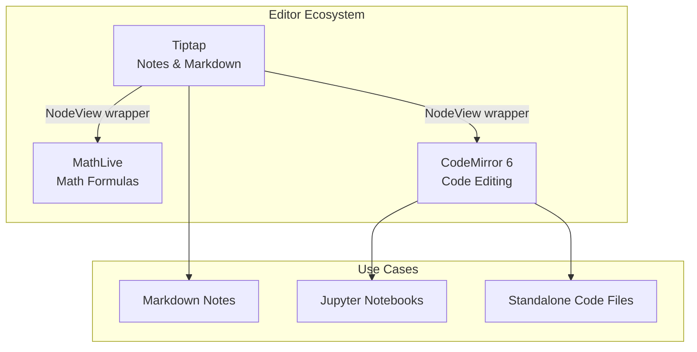
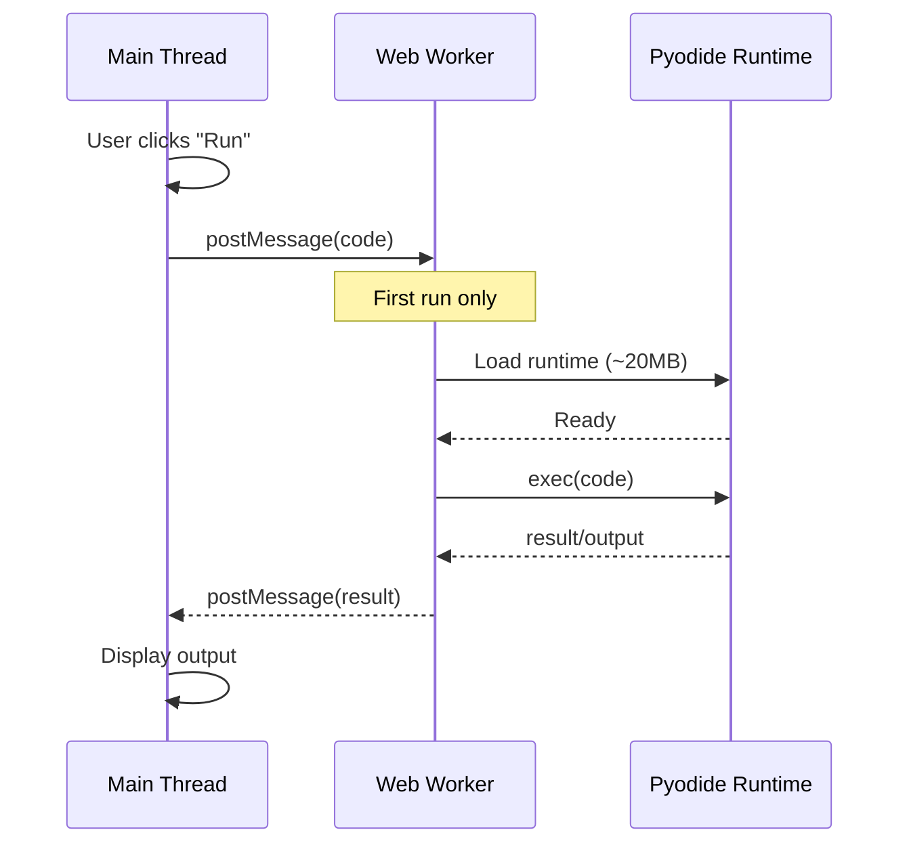
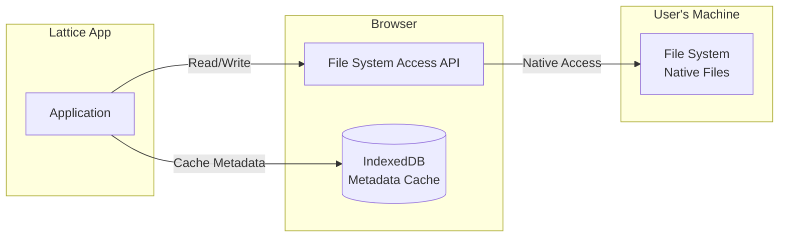
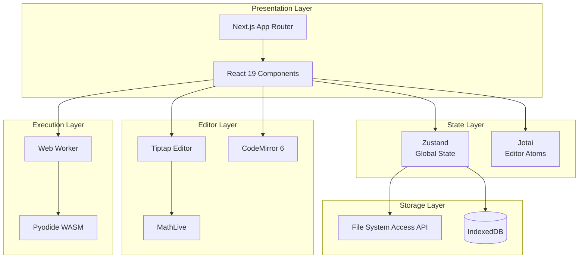
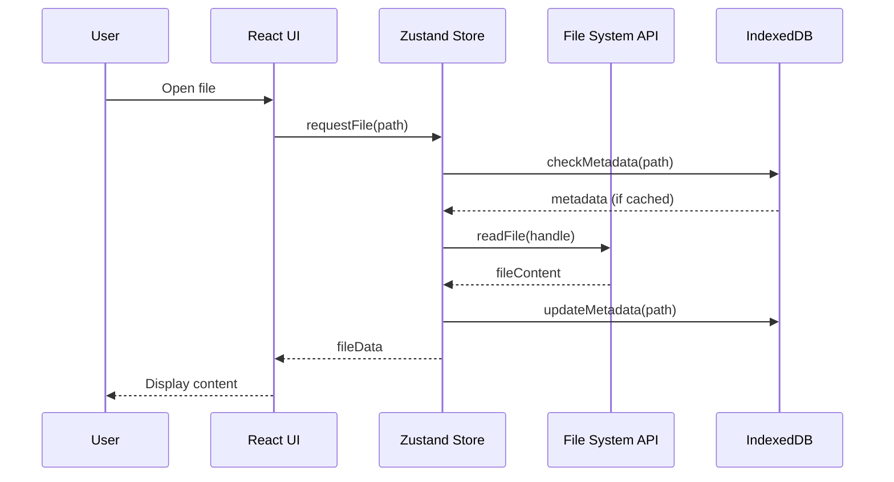

# Lattice Architecture

> **Source of Truth** for the Lattice project's technical decisions and component relationships.
> 
> Last Updated: January 2026 | Version: 1.0

---

## Table of Contents

1. [Philosophy](#philosophy)
2. [Frontend Core](#frontend-core)
3. [State Management](#state-management)
4. [Editor Ecosystem](#editor-ecosystem)
5. [Execution Engine](#execution-engine)
6. [Storage Layer](#storage-layer)
7. [Component Diagrams](#component-diagrams)

---

## Philosophy

### Lightweight & High-Performance

Lattice follows a **"Lightweight & High-Performance"** architecture principle. Every technology choice prioritizes:

- **Bundle size**: Smaller is better. We reject bloated libraries.
- **Time-to-interactive**: The app must feel instant.
- **Lazy loading**: Heavy resources load on-demand, never eagerly.
- **Web standards**: Prefer native browser APIs over polyfills.

This philosophy directly influenced our rejection of Monaco Editor (2MB+ bundle) in favor of CodeMirror 6 (~150KB), and our lazy-loading strategy for Pyodide (20MB WASM runtime).

---

## Frontend Core

| Technology | Version | Purpose |
|------------|---------|---------|
| **Next.js** | 15+ | Framework with App Router |
| **React** | 19 | UI library with concurrent features |
| **Tailwind CSS** | 4+ | Utility-first styling |

### Why This Stack?

- **Next.js App Router**: Server components, streaming, and file-based routing
- **React 19**: Concurrent rendering for smooth editor interactions
- **Tailwind**: Zero-runtime CSS, tree-shakeable, design system friendly

---

## State Management

We use a **dual-store architecture** to separate concerns:

| Library | Scope | Use Case |
|---------|-------|----------|
| **Zustand** | Global | Workspace state (open files, layout, settings) |
| **Jotai** | Atomic | Editor state (cursor position, selection, undo history) |

### Why Two Libraries?

```
┌─────────────────────────────────────────────────────────┐
│                    Zustand Store                        │
│  ┌─────────────┐  ┌─────────────┐  ┌─────────────┐     │
│  │ Open Files  │  │   Layout    │  │  Settings   │     │
│  └─────────────┘  └─────────────┘  └─────────────┘     │
└─────────────────────────────────────────────────────────┘
                           │
                           ▼
┌─────────────────────────────────────────────────────────┐
│                    Jotai Atoms                          │
│  ┌─────────┐  ┌─────────┐  ┌─────────┐  ┌─────────┐   │
│  │ Editor1 │  │ Editor2 │  │ Editor3 │  │ Editor4 │   │
│  │  State  │  │  State  │  │  State  │  │  State  │   │
│  └─────────┘  └─────────┘  └─────────┘  └─────────┘   │
└─────────────────────────────────────────────────────────┘
```

- **Zustand**: Simple, minimal boilerplate, perfect for app-wide state
- **Jotai**: Atomic updates prevent unnecessary re-renders in editors

---

## Editor Ecosystem

### Overview



### Markdown Editor: CodeMirror 6 Live Preview

**Technology**: [CodeMirror 6](https://codemirror.net/) with custom decoration system

**Features**:
- Obsidian-style live preview mode
- Cursor-based syntax reveal
- Real-time rendering of headings, math, code blocks, tables
- Three view modes: Live Preview, Source, Reading

**Architecture**:
- **Decoration Coordinator**: Unified rendering system that replaces 6+ legacy plugins
- **Cursor Context Plugin**: Reveals syntax only near cursor position
- **Widget System**: Custom widgets for math (KaTeX), code blocks (highlight.js), tables
- **Performance**: Full document parsing with LRU cache for optimal speed

**Why This Approach?**:
- Single-pass document parsing eliminates redundant work
- Conflict resolution prevents decoration overlaps
- Viewport-independent rendering ensures long files display correctly

### Math Editor: MathLive

**Technology**: [MathLive](https://cortexjs.io/mathlive/) (Web Component)

**Integration**: Wrapped as a Tiptap NodeView

**Why MathLive?**
- Native web component (framework agnostic)
- Visual WYSIWYG math editing
- Supports LaTeX input/output
- Accessible (screen reader support)

See [UX_GUIDELINES.md](./UX_GUIDELINES.md) for the "Structure-First" interaction philosophy.

### Code Editor: CodeMirror 6

> ⚠️ **CRITICAL DECISION**: We use **CodeMirror 6**, NOT Monaco Editor.

**Technology**: [CodeMirror 6](https://codemirror.net/)

**Use Cases**:
1. Standalone code files (.py, .js, .ts, etc.)
2. Jupyter notebook code cells
3. Inline code blocks in Tiptap

#### Why CodeMirror 6 Over Monaco?

| Criteria | CodeMirror 6 | Monaco Editor |
|----------|--------------|---------------|
| Bundle Size | ~150KB | 2MB+ |
| Mobile Support | ✅ Excellent | ❌ Poor |
| Customization | ✅ Modular | ⚠️ Monolithic |
| Performance | ✅ Lightweight | ⚠️ Heavy |
| Integration | ✅ Easy embed | ⚠️ Complex |

**Monaco is REJECTED** for the following reasons:
1. **Bundle bloat**: 2MB+ adds unacceptable load time
2. **Mobile unfriendly**: Monaco has poor touch/mobile support
3. **Overkill**: We don't need full IDE features (IntelliSense, debugging)
4. **Integration friction**: Monaco wants to own the entire viewport

---

## PDF Annotation System

### Overview (Zotero-style)

The PDF annotation system is designed to match Zotero's professional annotation experience.

```
┌─────────────────────────────────────────────────────────────────┐
│  [filename.pdf]     [H][U][N][T][A][D]     [-][120%][+][⟷]     │
├─────────────────────────────────────────────────────────────────┤
│  ┌─────────────────────────────────────────────────────────┐   │
│  │                                                         │   │
│  │                    PDF Content                          │   │
│  │                                                         │   │
│  │    ████████████  ← Highlighted text                     │   │
│  │                                                         │   │
│  │    📝 ← Sticky note                                     │   │
│  │                                                         │   │
│  └─────────────────────────────────────────────────────────┘   │
└─────────────────────────────────────────────────────────────────┘
```

### Toolbar Layout

| Section | Tools |
|---------|-------|
| **Left** | File name |
| **Center** | Annotation modes: Select, Highlight, Area, Text Note |
| **Right** | Page navigation, Zoom controls, Sidebar toggle |

### Annotation Modes

| Mode | Icon | Description |
|------|------|-------------|
| **Select** | Cursor | Default mode - click annotations to edit/comment |
| **Highlight** | Highlighter | Select text to highlight with color picker |
| **Area** | Square | Drag to create area highlights (or Alt+drag in any mode) |
| **Text Note** | Type | Click to add editable text annotations |

### Annotation Interaction

**Text Annotations (Type icon)**:
- Click anywhere on the annotation to open editor
- Edit text content, background color, text color, and font size
- Delete annotation from editor
- Full area responds to clicks (not just initial point)

**Other Annotations (Highlights, Areas)**:
- Click to add/edit comments
- Hover shows existing comments
- Visual feedback on hover (brightness increase)

**Mode-Based Behavior**:
- Select mode: Click annotations to interact
- Highlight mode: Select text to create highlights
- Area mode: Drag to create area highlights
- Text Note mode: Click to add new text annotations

### Zoom Controls

| Control | Shortcut | Description |
|---------|----------|-------------|
| **Zoom In** | Ctrl++ | Increase by 25% |
| **Zoom Out** | Ctrl+- | Decrease by 25% |
| **Reset** | Ctrl+0 | Reset to 100% |
| **Wheel Zoom** | Ctrl+Scroll | Smooth zoom |
| **Fit Width** | Button | Fit PDF to container width |

### Key Features

1. **Full Editing Capabilities**: 
   - Text annotations are fully editable (content, colors, font size)
   - Click anywhere on annotation to edit
   - Delete annotations directly from editor
2. **Enhanced Click Detection**:
   - Entire annotation area responds to clicks
   - Visual hover feedback (ring highlight, brightness increase)
   - Pointer-events optimization for indicators
3. **Mode-Based Interaction**:
   - Clear separation between select, highlight, area, and text note modes
   - Prevents accidental operations
   - Visual mode indicators in toolbar
4. **Viewport Center Preservation**: When zooming, the document point at viewport center stays centered
5. **Color Picker**: Quick color selection for highlights and text annotations
6. **Persistent Storage**: Annotations saved to `.lattice/annotations/` directory
7. **Annotation Sidebar**: Navigate between annotations with preview

---

## Execution Engine

### Pyodide (Python in WebAssembly)

**Technology**: [Pyodide](https://pyodide.org/) - CPython compiled to WebAssembly

**Runtime Environment**: Isolated **Web Worker**



### Loading Strategy: Lazy-on-Demand

> ⚠️ **CRITICAL**: Pyodide is **NEVER** loaded on page load.

**The 20MB runtime is only fetched when**:
1. User clicks "Run" button on a code cell
2. User explicitly requests Python execution

**Why Lazy Loading?**
- 20MB is too large for eager loading
- Most users may never execute Python
- Preserves fast initial page load
- Progressive enhancement pattern

**Implementation**:
```typescript
// ❌ WRONG: Eager loading
import { loadPyodide } from 'pyodide';
const pyodide = await loadPyodide(); // Blocks page load!

// ✅ CORRECT: Lazy loading
async function runPython(code: string) {
  const { loadPyodide } = await import('pyodide');
  const pyodide = await loadPyodide();
  return pyodide.runPython(code);
}
```

---

## Storage Layer

### Dual Storage Architecture



### Primary: File System Access API

**Technology**: [File System Access API](https://developer.mozilla.org/en-US/docs/Web/API/File_System_Access_API)

**Capabilities**:
- Direct read/write to user's local files
- No upload/download friction
- Real file handles (not copies)
- Directory picker for workspaces

**Browser Support**: Chrome, Edge (Chromium-based browsers)

### Secondary: IndexedDB (Metadata Cache)

**Purpose**: Cache file metadata for performance

**Cached Data**:
- File tree structure
- Last modified timestamps
- File type classifications
- Recently opened files

**NOT Cached**: File contents (always read from disk)

---

## Component Diagrams

### Full System Architecture



### Data Flow: File Operations



---

## Related Documents

- [UX_GUIDELINES.md](./UX_GUIDELINES.md) - Interaction philosophy and patterns
- [PROJECT_CONTEXT.md](./PROJECT_CONTEXT.md) - Current status and decision log
