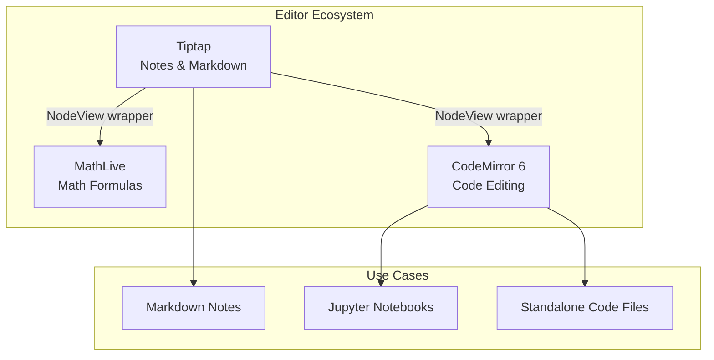
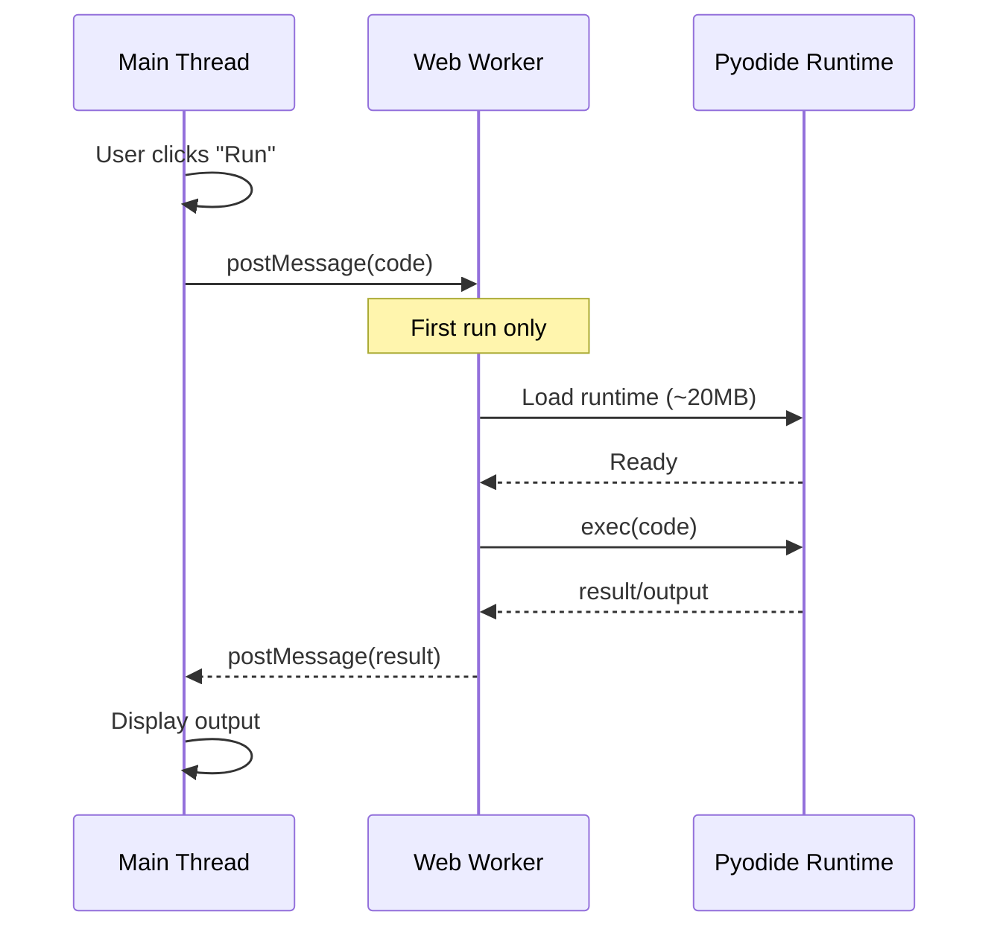
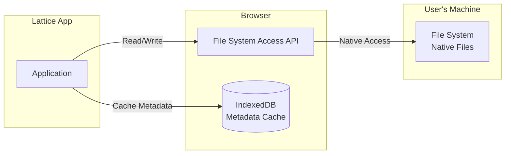
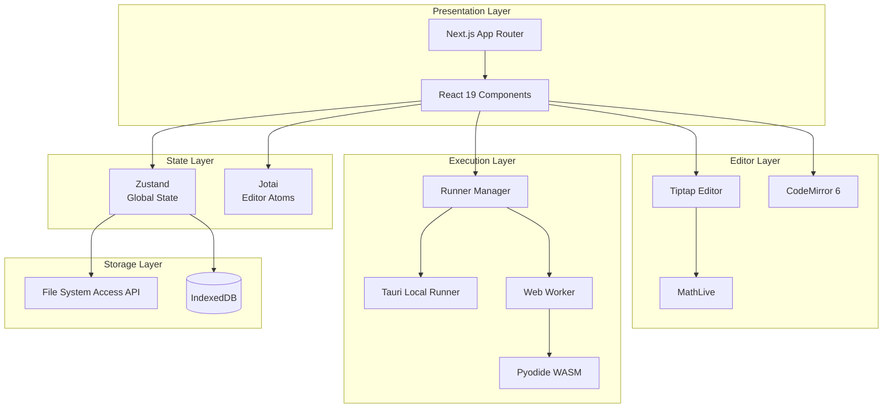
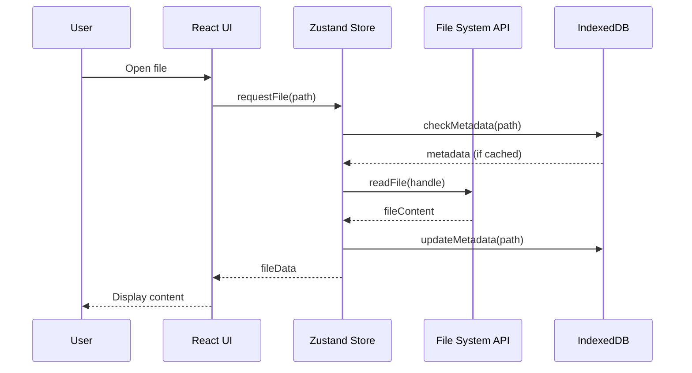

# Lattice Architecture

> **Source of Truth** for the Lattice project's technical decisions and component relationships.
> 
> Last Updated: 2026-03-21 | Version: 2.0

---

## Table of Contents

1. [Philosophy](#philosophy)
2. [Frontend Core](#frontend-core)
3. [State Management](#state-management)
4. [Editor Ecosystem](#editor-ecosystem)
5. [Execution Engine](#execution-engine)
6. [AI System](#ai-system)
7. [Storage Layer](#storage-layer)
8. [Component Diagrams](#component-diagrams)

---

## Philosophy

### Lightweight & High-Performance

Lattice follows a **"Lightweight & High-Performance"** architecture principle. Every technology choice prioritizes:

- **Bundle size**: Smaller is better. We reject bloated libraries.
- **Time-to-interactive**: The app must feel instant.
- **Lazy loading**: Heavy resources load on-demand, never eagerly.
- **Web standards**: Prefer native browser APIs over polyfills.

This philosophy directly influenced our rejection of Monaco Editor (2MB+ bundle) in favor of CodeMirror 6 (~150KB), and our hybrid execution strategy: desktop shells prefer local runtimes, while the web app keeps Pyodide as an on-demand fallback.

The current architecture is intentionally optimized around a **local-first research workbench**:

- documents, code, notebooks, and AI evidence stay in the same workspace
- execution surfaces share one runner/problem model
- desktop and web builds share the same product shell, but diverge where local runtimes matter
- release engineering is treated as part of the product, not as an afterthought

---

## Frontend Core

| Technology | Version | Purpose |
|------------|---------|---------|
| **Next.js** | 16.x | Framework with App Router |
| **React** | 19.x | UI library with concurrent features |
| **Tailwind CSS** | 3.4.x | Utility-first styling |
| **Tauri** | 2.x | Desktop shell and local runtime bridge |

### Why This Stack?

- **Next.js App Router**: Server components, streaming, and file-based routing
- **React 19**: Concurrent rendering for smooth editor interactions
- **Tailwind**: Utility-first styling without introducing a second UI framework
- **Tauri 2**: Small desktop footprint with explicit local execution and filesystem access

---

## State Management

We use a **dual-store architecture** to separate concerns:

| Library | Scope | Use Case |
|---------|-------|----------|
| **Zustand** | Global | Workspace state (open files, layout, settings) |
| **Jotai** | Atomic | Editor state (cursor position, selection, undo history) |

### Why Two Libraries?

```
┌─────────────────────────────────────────────────────────┐
│                    Zustand Store                        │
│  ┌─────────────┐  ┌─────────────┐  ┌─────────────┐     │
│  │ Open Files  │  │   Layout    │  │  Settings   │     │
│  └─────────────┘  └─────────────┘  └─────────────┘     │
└─────────────────────────────────────────────────────────┘
                           │
                           ▼
┌─────────────────────────────────────────────────────────┐
│                    Jotai Atoms                          │
│  ┌─────────┐  ┌─────────┐  ┌─────────┐  ┌─────────┐   │
│  │ Editor1 │  │ Editor2 │  │ Editor3 │  │ Editor4 │   │
│  │  State  │  │  State  │  │  State  │  │  State  │   │
│  └─────────┘  └─────────┘  └─────────┘  └─────────┘   │
└─────────────────────────────────────────────────────────┘
```

- **Zustand**: Simple, minimal boilerplate, perfect for app-wide state
- **Jotai**: Atomic updates prevent unnecessary re-renders in editors

---

## Editor Ecosystem

### Overview


```mermaid
graph TB
    subgraph "Editor Ecosystem"
        TIPTAP[Tiptap<br/>Notes & Markdown]
        MATHLIVE[MathLive<br/>Math Formulas]
        CM6[CodeMirror 6<br/>Code Editing]
    end
    
    TIPTAP -->|NodeView wrapper| MATHLIVE
    TIPTAP -->|NodeView wrapper| CM6
    
    subgraph "Use Cases"
        NOTES[Markdown Notes]
        JUPYTER[Jupyter Notebooks]
        CODE[Standalone Code Files]
    end
    
    TIPTAP --> NOTES
    CM6 --> JUPYTER
    CM6 --> CODE
```

### Markdown Editor: CodeMirror 6 Live Preview

**Technology**: [CodeMirror 6](https://codemirror.net/) with custom decoration system

**Features**:
- Obsidian-style live preview mode
- Cursor-based syntax reveal
- Real-time rendering of headings, math, code blocks, tables
- Three view modes: Live Preview, Source, Reading

**Architecture**:
- **Decoration Coordinator**: Unified rendering system that replaces 6+ legacy plugins
- **Cursor Context Plugin**: Reveals syntax only near cursor position
- **Widget System**: Custom widgets for math (KaTeX), code blocks (highlight.js), tables
- **Performance**: Full document parsing with LRU cache for optimal speed

**Why This Approach?**:
- Single-pass document parsing eliminates redundant work
- Conflict resolution prevents decoration overlaps
- Viewport-independent rendering ensures long files display correctly

### Math Editor: MathLive

**Technology**: [MathLive](https://cortexjs.io/mathlive/) (Web Component)

**Integration**: Wrapped as a Tiptap NodeView

**Why MathLive?**
- Native web component (framework agnostic)
- Visual WYSIWYG math editing
- Supports LaTeX input/output
- Accessible (screen reader support)

See [UX_GUIDELINES.md](./UX_GUIDELINES.md) for the "Structure-First" interaction philosophy.

### Code Editor: CodeMirror 6

> ⚠️ **CRITICAL DECISION**: We use **CodeMirror 6**, NOT Monaco Editor.

**Technology**: [CodeMirror 6](https://codemirror.net/)

**Use Cases**:
1. Standalone code files (.py, .js, .ts, etc.)
2. Jupyter notebook code cells
3. Inline code blocks in Tiptap

#### Why CodeMirror 6 Over Monaco?

| Criteria | CodeMirror 6 | Monaco Editor |
|----------|--------------|---------------|
| Bundle Size | ~150KB | 2MB+ |
| Mobile Support | ✅ Excellent | ❌ Poor |
| Customization | ✅ Modular | ⚠️ Monolithic |
| Performance | ✅ Lightweight | ⚠️ Heavy |
| Integration | ✅ Easy embed | ⚠️ Complex |

**Monaco is REJECTED** for the following reasons:
1. **Bundle bloat**: 2MB+ adds unacceptable load time
2. **Mobile unfriendly**: Monaco has poor touch/mobile support
3. **Phase mismatch**: this stage targets a scientific workbench with strong local execution, not a full VS Code clone with debugger/LSP parity
4. **Integration friction**: Monaco wants to own the entire viewport

---

## PDF Annotation System

### Overview (Zotero-style)

The PDF annotation system is designed to match Zotero's professional annotation experience.

```
┌─────────────────────────────────────────────────────────────────┐
│  [filename.pdf]     [H][U][N][T][A][D]     [-][120%][+][⟷]     │
├─────────────────────────────────────────────────────────────────┤
│  ┌─────────────────────────────────────────────────────────┐   │
│  │                                                         │   │
│  │                    PDF Content                          │   │
│  │                                                         │   │
│  │    ████████████  ← Highlighted text                     │   │
│  │                                                         │   │
│  │    📝 ← Sticky note                                     │   │
│  │                                                         │   │
│  └─────────────────────────────────────────────────────────┘   │
└─────────────────────────────────────────────────────────────────┘
```

### Toolbar Layout

| Section | Tools |
|---------|-------|
| **Left** | File name |
| **Center** | Annotation modes: Select, Highlight, Area, Text Note |
| **Right** | Page navigation, Zoom controls, Sidebar toggle |

### Annotation Modes

| Mode | Icon | Description |
|------|------|-------------|
| **Select** | Cursor | Default mode - click annotations to edit/comment |
| **Highlight** | Highlighter | Select text to highlight with color picker |
| **Area** | Square | Drag to create area highlights (or Alt+drag in any mode) |
| **Text Note** | Type | Click to add editable text annotations |

### Annotation Interaction

**Text Annotations (Type icon)**:
- Click anywhere on the annotation to open editor
- Edit text content, background color, text color, and font size
- Delete annotation from editor
- Full area responds to clicks (not just initial point)

**Other Annotations (Highlights, Areas)**:
- Click to add/edit comments
- Hover shows existing comments
- Visual feedback on hover (brightness increase)

**Mode-Based Behavior**:
- Select mode: Click annotations to interact
- Highlight mode: Select text to create highlights
- Area mode: Drag to create area highlights
- Text Note mode: Click to add new text annotations

### Zoom Controls

| Control | Shortcut | Description |
|---------|----------|-------------|
| **Zoom In** | Ctrl++ | Increase by 25% |
| **Zoom Out** | Ctrl+- | Decrease by 25% |
| **Reset** | Ctrl+0 | Reset to 100% |
| **Wheel Zoom** | Ctrl+Scroll | Smooth zoom |
| **Fit Width** | Button | Fit PDF to container width |

### Key Features

1. **Full Editing Capabilities**: 
   - Text annotations are fully editable (content, colors, font size)
   - Click anywhere on annotation to edit
   - Delete annotations directly from editor
2. **Enhanced Click Detection**:
   - Entire annotation area responds to clicks
   - Visual hover feedback (ring highlight, brightness increase)
   - Pointer-events optimization for indicators
3. **Mode-Based Interaction**:
   - Clear separation between select, highlight, area, and text note modes
   - Prevents accidental operations
   - Visual mode indicators in toolbar
4. **Viewport Center Preservation**: When zooming, the document point at viewport center stays centered
5. **Color Picker**: Quick color selection for highlights and text annotations
6. **Persistent Storage**: Annotations saved to `.lattice/annotations/` directory
7. **Annotation Sidebar**: Navigate between annotations with preview

---

## Execution Engine

### Unified Runner Model

Lattice now exposes a single runner event model across code files, notebook cells, and markdown code blocks.

**Runner types in the current phase**:
- **`python-local`**: Preferred on desktop. Runs local Python with real process execution and streamed events.
- **`external-command`**: Minimal support for Node, Julia, and Rscript through explicit command templates.
- **`python-pyodide`**: Web and desktop fallback when no local Python is available.

**Current scope boundary**:
- We do support local execution, streamed stdout/stderr, stop/rerun, and rich outputs such as images and HTML tables.
- We do **not** yet target full IDE parity such as breakpoints, call stacks, or deep LSP integration in this phase.

### Desktop Local Execution

On desktop, the frontend talks to the Tauri backend through a unified runner API. The backend is responsible for:

- Discovering Python environments (`system`, `.venv`, `conda`)
- Probing external command availability
- Spawning local child processes
- Streaming `stdout` / `stderr`
- Emitting structured `display_data`, `error`, `completed`, and `terminated` events
- Terminating in-flight executions

Python execution uses a lightweight bootstrap wrapper so Lattice can normalize common scientific outputs such as:
- plain text streams
- traceback/error payloads
- HTML tables
- rendered matplotlib figures

### Persistent Notebook Sessions

In the current desktop phase, notebook cells running on `python-local` reuse a persistent local Python process instead of spawning a fresh interpreter for every cell. This gives notebook execution the expected scientific workflow semantics:

- variables persist across cells
- rerun/interrupt/restart operate on the same local session lifecycle
- notebook output still flows through the same unified runner event model

This is intentionally narrower than a full kernel gateway or remote Jupyter management layer. The current goal is reliable local execution for real desktop work, not multi-kernel orchestration.

---

## AI System

### AI-Native Research Copilot v1

Lattice now uses a unified AI system instead of separate, component-specific prompt pipelines. The current phase is centered on an **evidence-first research copilot** for personal researchers.

**Core building blocks**:

- **`AiOrchestrator`**: single entry point for chat, inline actions, research actions, and safe task proposals
- **`AiContextGraph`**: resolves focus context from files, headings, notebook cells, annotations, code symbols, workspace chunks, and current selection
- **`EvidenceRef`**: shared evidence model for file paths, markdown headings, PDF pages/annotations, code lines, and notebook cells
- **`AiDraftArtifact`**: write-back target for summaries, reading notes, formula explainers, code notes, and comparison drafts
- **`AiTaskProposal`**: half-automatic task plan that enumerates reads/writes before any user-approved action
- **`ModelRouter`**: provider selection policy that keeps local models and cloud models under one routing layer

### Workbench Approval Layer

- Drafts are surfaced in a dedicated **AI Workbench** panel instead of being applied immediately
- Approved drafts can either:
  - create a new markdown file under the default drafts area
  - write to a user-selected target path
  - append into an existing markdown note after explicit approval
- Applied drafts record the resolved target path so users can reopen the written note directly from the workbench

### Current Interaction Model

- Side chat, inline menu, PDF assistant, and notebook assistant all call the same orchestrator
- Scientific answers default to evidence-first output and expose context sources in the UI
- Write-back flows default to **draft only**
- File creation or content changes require explicit user approval through proposals
- Evidence navigation is actionable and visible: target jumps for headings, code lines, notebook cells, and PDF references now provide transient highlight feedback after navigation

### Scope Boundary

This phase intentionally does **not** attempt to match general-purpose autonomous agents or full IDE copilots. Current focus is:

- evidence-grounded answers
- structured draft generation
- workspace-aware knowledge organization
- safe, approval-gated task proposals

Not included in the current phase:

- autonomous long-running multi-step execution
- silent batch rewrites
- background agent loops
- debugger/LSP-style code intelligence parity

### Pyodide (Python in WebAssembly)

**Technology**: [Pyodide](https://pyodide.org/) - CPython compiled to WebAssembly

**Runtime Environment**: Isolated **Web Worker**


```mermaid
sequenceDiagram
    participant UI as Main Thread
    participant Worker as Web Worker
    participant Pyodide as Pyodide Runtime
    
    UI->>UI: User clicks "Run"
    UI->>Worker: postMessage(code)
    
    Note over Worker: First run only
    Worker->>Pyodide: Load runtime (~20MB)
    Pyodide-->>Worker: Ready
    
    Worker->>Pyodide: exec(code)
    Pyodide-->>Worker: result/output
    Worker-->>UI: postMessage(result)
    UI->>UI: Display output
```

### Loading Strategy: Lazy-on-Demand

> ⚠️ **CRITICAL**: Pyodide is **NEVER** loaded on page load.

**The 20MB runtime is only fetched when**:
1. User clicks "Run" button on a code cell
2. User explicitly requests Python execution

**Why Lazy Loading?**
- 20MB is too large for eager loading
- Most users may never execute Python
- Preserves fast initial page load
- Progressive enhancement pattern for web and desktop fallback

**Implementation**:
```typescript
// ❌ WRONG: Eager loading
import { loadPyodide } from 'pyodide';
const pyodide = await loadPyodide(); // Blocks page load!

// ✅ CORRECT: Lazy loading
async function runPython(code: string) {
  const { loadPyodide } = await import('pyodide');
  const pyodide = await loadPyodide();
  return pyodide.runPython(code);
}
```

### QA Gate v1

The current phase also formalizes a repeatable product gate for desktop delivery:

- `npm run lint` must stay at zero errors, with warnings frozen and reduced incrementally
- `npm run typecheck`
- `npm run test:run`
- `npm run build`
- `npm run tauri:build`

This gate is the minimum definition of "ready to ship locally" for the desktop scientific workbench phase.

---

## Storage Layer

### Dual Storage Architecture


```mermaid
graph LR
    subgraph "User's Machine"
        FS[File System<br/>Native Files]
    end
    
    subgraph "Browser"
        FSAPI[File System Access API]
        IDB[(IndexedDB<br/>Metadata Cache)]
    end
    
    subgraph "Lattice App"
        APP[Application]
    end
    
    APP -->|Read/Write| FSAPI
    FSAPI -->|Native Access| FS
    APP -->|Cache Metadata| IDB
```

### Primary: File System Access API

**Technology**: [File System Access API](https://developer.mozilla.org/en-US/docs/Web/API/File_System_Access_API)

**Capabilities**:
- Direct read/write to user's local files
- No upload/download friction
- Real file handles (not copies)
- Directory picker for workspaces

**Browser Support**: Chrome, Edge (Chromium-based browsers)

### Secondary: IndexedDB (Metadata Cache)

**Purpose**: Cache file metadata for performance

**Cached Data**:
- File tree structure
- Last modified timestamps
- File type classifications
- Recently opened files

**NOT Cached**: File contents (always read from disk)

---

## Component Diagrams

### Full System Architecture


```mermaid
graph TB
    subgraph "Presentation Layer"
        NEXT[Next.js App Router]
        REACT[React 19 Components]
    end
    
    subgraph "Editor Layer"
        TIPTAP[Tiptap Editor]
        MATHLIVE[MathLive]
        CM6[CodeMirror 6]
    end
    
    subgraph "State Layer"
        ZUSTAND[Zustand<br/>Global State]
        JOTAI[Jotai<br/>Editor Atoms]
    end
    
    subgraph "Execution Layer"
        RUNNER[Runner Manager]
        TAURIRUN[Tauri Local Runner]
        WORKER[Web Worker]
        PYODIDE[Pyodide WASM]
    end
    
    subgraph "Storage Layer"
        FSAPI[File System Access API]
        IDB[(IndexedDB)]
    end
    
    NEXT --> REACT
    REACT --> TIPTAP
    REACT --> CM6
    TIPTAP --> MATHLIVE
    
    REACT --> ZUSTAND
    REACT --> JOTAI
    
    REACT --> RUNNER
    RUNNER --> TAURIRUN
    RUNNER --> WORKER
    WORKER --> PYODIDE
    
    ZUSTAND --> FSAPI
    ZUSTAND --> IDB
```

### Data Flow: File Operations


```mermaid
sequenceDiagram
    participant User
    participant UI as React UI
    participant Store as Zustand Store
    participant FS as File System API
    participant Cache as IndexedDB
    
    User->>UI: Open file
    UI->>Store: requestFile(path)
    Store->>Cache: checkMetadata(path)
    Cache-->>Store: metadata (if cached)
    Store->>FS: readFile(handle)
    FS-->>Store: fileContent
    Store->>Cache: updateMetadata(path)
    Store-->>UI: fileData
    UI-->>User: Display content
```

---

## Related Documents

- [UX_GUIDELINES.md](./UX_GUIDELINES.md) - Interaction philosophy and patterns
- [PROJECT_CONTEXT.md](./PROJECT_CONTEXT.md) - Current status and decision log
